# 🏛️ Emir Code System Architecture

This document provides a comprehensive technical breakdown of **Emir Code**, an AI-native autonomous coding assistant built with Electron, React 19, TypeScript, and Tailwind CSS, pairing locally with Ollama.

---

## 1. Architectural Philosophy

Emir Code was designed around four non-negotiable principles:

1. **Ironclad Local Privacy**: Zero telemetry, zero cloud dependencies. Your source code and intellectual property never leave your workstation.
2. **Cryptographic Sandbox Containment**: Autonomous agents should never have arbitrary write authority. All operations run inside an unbypassable, operating-system-level Realpath jail.
3. **Deterministic Anti-Loop Reliability**: Local models (such as `qwen2.5-coder:1.5b` or `deepseek-coder-v2`) have constrained reasoning horizons. The engine provides deterministic scaffolding so smaller models cannot enter infinite repetitive loops.
4. **AAA Minimalist User Experience**: Inspired by Linear, Cursor, and Raycast, the interface emphasizes subdued typography, 95% neutral zinc surfaces, and zero "AI slop" (no flashy ping animations, no redundant neon tags, no intrusive modal popups).

---

## 2. Multi-Process System Topology

Emir Code enforces a strict multi-process isolation model following Chromium and Electron best practices:

```
+-------------------------------------------------------------------------+
|                            Operating System                             |
+-------------------------------------------------------------------------+
                                    ^
                                    | (Restricted Win32 / fs calls)
                                    v
+-------------------------------------------------------------------------+
|                     Electron Main Process (Node.js)                     |
|  - Realpath Path Resolution & Workspace Jail Containment                |
|  - Cryptographic 256-bit Mutation Token Vault                           |
|  - Authentic SHA-256 Base Hash Integrity Verifier                       |
|  - Atomic Temporary-File Swap Engine (fs.renameSync)                    |
|  - Snapshot & Rollback Registry                                         |
|  - Strict Command Allowlist & Executable Validator                      |
+-------------------------------------------------------------------------+
                                    ^
                                    | (contextBridge / Typed IPC only)
                                    v
+-------------------------------------------------------------------------+
|                        Preload Script (Isolated)                        |
|  - contextIsolation: true                                               |
|  - nodeIntegration: false                                               |
|  - Typed window.electronAPI Interface                                   |
+-------------------------------------------------------------------------+
                                    ^
                                    | (Asynchronous IPC messaging)
                                    v
+-------------------------------------------------------------------------+
|                  Renderer Process (Vite + React 19)                     |
|  +-------------------------------------------------------------------+  |
|  | State Stores (Zustand: chatStore, agentStore, settingsStore)      |  |
|  +-------------------------------------------------------------------+  |
|  | Autonomous Agent Engine (AgentEngine.ts)                          |  |
|  |  - Goal Decomposition & Step Execution Loop                       |  |
|  |  - Anti-Loop Guard (Pre-flight Probing & 4-Step Cycle Breaker)    |  |
|  |  - Fuzzy Path Matcher (findClosestPath)                           |  |
|  |  - Two-Tier Sliding-Window Context Compressor                     |  |
|  +-------------------------------------------------------------------+  |
|  | Local LLM Communication (OllamaClient.ts - NDJSON Streaming)      |  |
|  +-------------------------------------------------------------------+  |
|  | AAA Minimalist Presentation Layer                                 |  |
|  |  - Breadcrumb Sub-Header & Unified Security Selector              |  |
|  |  - Collapsible Monochromatic Thought Accordion                    |  |
|  |  - Inline Clarification Question Stream (Zero Popups)             |  |
|  |  - Myers / LCS Line-by-Line Diff Viewer                           |  |
|  +-------------------------------------------------------------------+  |
+-------------------------------------------------------------------------+
```

---

## 3. Autonomous Execution Lifecycle

The diagram below illustrates how a developer's high-level goal translates into safe, verified disk mutations:

```mermaid
sequenceDiagram
    autonumber
    actor Dev as Developer
    participant UI as AgentWorkspace (React)
    participant Engine as AgentEngine
    participant Ollama as Local Ollama Server
    participant Main as Electron Main (Privileged)
    participant Disk as Local Filesystem

    Dev->>UI: Submits Goal ("Fix null pointer in UserProfile.tsx")
    UI->>Engine: startGoal(goalText)
    
    rect rgb(24, 24, 27)
        Note over Engine,Main: Phase 1: Pre-Flight Environment Probing
        Engine->>Main: probeGitStatus() & listWorkspaceFiles()
        Main-->>Engine: { gitAvailable: true/false, projectTree: [...] }
        Engine->>Engine: Mask non-existent tools from JSON schema
    end

    loop Autonomous Reasoning Cycle (Max 30 iterations)
        Engine->>Ollama: Stream Prompt + Ledger Block (Sliding Window)
        Ollama-->>Engine: Reasoning Stream (NDJSON tokens)
        Engine->>UI: Update Live Thought Accordion (Monochrome)
        
        alt Tool Call: read_file
            Engine->>Main: readFile(path)
            Main->>Main: Verify Realpath Jail
            Main-->>Engine: fileContent + baseHash
            Engine->>Engine: Record file in Memory Ledger
        else Tool Call: propose_edit
            Engine->>UI: Render Myers/LCS Diff Reviewer
            alt Security Profile: Strict
                Dev->>UI: Click "Approve Changes"
                UI->>Engine: Confirm Approval
            else Security Profile: Balanced (Non-conflicting)
                Engine->>Engine: Auto-Approve inside Jail
            end
            
            Engine->>Main: requestMutationToken(path, 'modify', baseHash)
            Main->>Main: Validate 256-bit crypto token
            Main-->>Engine: singleUseToken
            Engine->>Main: applyApprovedMutation(token, path, newContent)
            Main->>Disk: Atomic temp file swap (fs.renameSync)
            Main-->>Engine: Mutation Applied (txHash)
            Engine->>Engine: Record Milestone in Ledger
        else Tool Call: ask_clarification
            Engine->>UI: Render Inline Question Card
            Dev->>UI: Select Option Chip or Enter Custom Answer
            UI->>Engine: submitAnswer(answer)
            Engine->>Engine: Record Decision in Ledger
        else Tool Call: finish
            Engine->>UI: Display Completion Summary
        end
    end
```



---

## 4. Anti-Loop Guard & Small Model Resilience

Smaller local language models (1.5B to 7B parameters) frequently enter infinite loops when encountering unfamiliar environments. Emir Code embeds a deterministic four-part defense:

### 1. Pre-Flight Environment Probing
Before inference starts, the engine determines whether external binaries (such as `git`) exist:
```ts
// src/lib/agent/AgentEngine.ts
try {
  await window.electronAPI.git.status(this.workspaceRoot);
  this.gitAvailable = true;
} catch {
  this.gitAvailable = false;
  this.ledger.unavailableBinaries.push('git');
}
```
If Git is missing, `read_git_status` and `read_git_diff` are dynamically removed from the tool definitions. **Models cannot call tools they cannot see.**

### 2. Fuzzy "Did-You-Mean?" Path Matcher
When small models guess approximate file paths (e.g., `App.js` instead of `src/App.tsx`), `findClosestPath` evaluates basename, extension, and Levenshtein similarity:
```ts
// Suggests exact match and injects hint directly into ledger
const suggested = findClosestPath(requestedPath, this.ledger.projectTree);
if (suggested) {
  return `[Hata]: '${requestedPath}' bulunamadı. 💡 İPUCU: Aradığınız dosya muhtemelen '${suggested}'!`;
}
```

### 3. Deterministic Ping-Pong Cycle Breaker
If the agent repeats the same sequence of actions within the last 4 iterations (e.g., Tool A -> Tool B -> Tool A -> Tool B), the Anti-Loop Guard triggers an immediate circuit interrupt:
```ts
// Prevents endless read/re-read cycles
if (this.detectActionLoop(recentActions)) {
  this.injectPromptDirective("DÖNGÜ UYARISI: Aynı adımları tekrarlıyorsunuz. Mevcut bulgularınızla bir sonraki aşamaya geçin veya 'finish' çağırın.");
}
```

---

## 5. Sliding-Window Memory Ledger

To prevent 8K-token context exhaustion when reading multiple files, Emir Code partitions context into two tiers:

1. **Active Structured Ledger**:
   - `goal`: Active objective
   - `projectTree`: Verified disk directory map
   - `milestones`: Completed phases (e.g., `[TAMAMLANDI] Dosya okundu: src/App.tsx`)
   - `userDecisions`: Architectural choices made by the user
2. **Observation Compression**:
   Turns older than 4 steps have their voluminous outputs compressed into semantic pointers:
   ```
   [Özet Gözlem: "src/components/agent/AgentWorkspace.tsx" incelendi (870 satır). Kritik detaylar oturum defterinde kayıtlıdır.]
   ```

---

## 6. The Realpath Jail & Mutation Vault

The filesystem security layer guarantees that under no circumstances can an LLM escape the workspace folder:

```ts
// electron/main.ts - Realpath verification
const resolvedTarget = path.resolve(activeWorkspaceRoot, requestedRelativePath);
const targetRealPath = fs.realpathSync(resolvedTarget);

if (!targetRealPath.startsWith(activeWorkspaceRoot + path.sep) && targetRealPath !== activeWorkspaceRoot) {
  throw new SecurityError("Sandbox Escape Attempt: Path resolved outside workspace boundary.");
}
```

Every write operation requires an unforgeable, single-use 256-bit token tied to the file's SHA-256 base hash. Writes are staged in a `.tmp` sibling file and swapped atomically using `fs.renameSync`.

---

## 7. AAA Minimalist UI Principles

The interface adheres to strict aesthetic guidelines:
- **Zero AI Slop**: No excessive pulsating neon dots, no purple sparkles, no generic marketing template animations.
- **Micro-Interactions**: Calm, single-state micro-spinners (`Loader2`) and quiet icons (`PanelRight`, `RotateCcw`, `FolderTree`).
- **Consistent Message Bar**: The Code Composer shares 100% visual and functional identity with the Chat Composer (same border, focus ring, dynamic `scrollHeight` expansion, and square action button).

---

## 8. Multi-Instruction Task Decomposition & Anti-Premature Termination Guard

A common defect in autonomous LLM agents is **Instruction Dropout / Premature Termination**: when a user specifies multiple tasks in a single prompt (e.g. *"Fix bug A, then implement feature B, update docs, and commit"*), models often resolve only the first task and prematurely call `finish` or write an exit summary.

Emir Code implements a deterministic, multi-tiered safeguard:

### 1. Goal Decomposition & Structured Checklist
When `AgentEngine.runGoal` starts, `decomposeGoalIntoSubtasks` analyzes the prompt across numbered lists, bullet points, and sequential natural language clauses (Turkish and English: `daha sonra`, `ardından`, `ve son olarak`, `then`, `after that`, semicolons). It establishes a typed checklist:
```ts
export interface TaskChecklistItem {
  id: string;
  description: string;
  status: 'pending' | 'in_progress' | 'completed';
  startedAt?: number;
  completedAt?: number;
}
```

### 2. Live Checklist in Session Memory Ledger
The dynamic memory ledger maintains and renders the checklist into the system context on every inference turn:
```
📋 GÖREV KONTROL LİSTESİ (TASK CHECKLIST - HEPSİ TAMAMLANMALIDIR):
  1. ✅ [TAMAMLANDI] İlk hatayı düzelt
  2. 🔄 [ŞU ANKİ AKTİF ODAK] Yeni kurucu üret
  3. ⏳ [BEKLEMEDE] Belgeleri güncelle ve commit et
```
The dynamic advice string directs the model to focus strictly on the current active subtask and explicitly forbids invoking `finish` while other subtasks are pending.

### 3. Anti-Premature Termination Interceptor
If the model prematurely attempts to:
- Invoke the `finish` tool action while subtasks remain pending, or
- Output conversational plain text without a JSON tool action,

the engine intercepts the action, marks the current subtask as completed, transitions the next subtask to `in_progress`, and returns a high-priority system feedback message (`[ERKEN BİTİRME ENGELİ]`) steering the model directly into the next subtask. Only when all subtasks have verified completion is the final `finished` status permitted.

