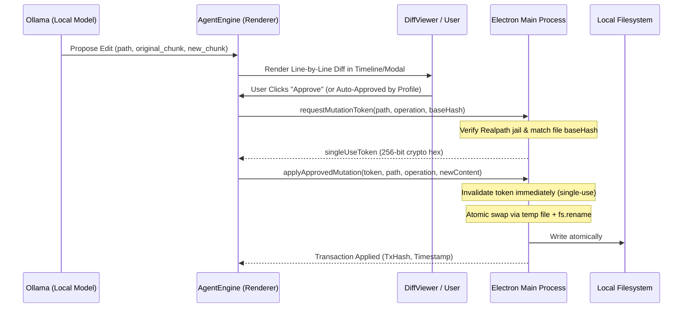

# 🏛️ Emir Code Architecture

This document details the software architecture, process boundaries, security model, and execution lifecycle of **Emir Code**.

---

## 1. Process Separation & Security Boundaries

Emir Code strictly follows the Chromium and Electron multi-process security model:

```
+-------------------------------------------------------------+
|                      Operating System                       |
+-------------------------------------------------------------+
                               ^
                               | (Restricted Win32 / fs calls)
                               v
+-------------------------------------------------------------+
|                 Electron Main Process (Node.js)             |
|  - Realpath Path Resolution & Jail Validator                |
|  - Cryptographic 256-bit Mutation Token Vault               |
|  - Authentic SHA-256 Base Hash Verifier                     |
|  - Atomic Temporary File Swap & Rollback Registry           |
|  - Strict Command Allowlist & Executable Validator          |
+-------------------------------------------------------------+
                               ^
                               | (contextBridge / IPC only)
                               v
+-------------------------------------------------------------+
|                   Preload Script (Isolated)                 |
|  - Context Isolation: contextIsolation=true                 |
|  - Node Integration: nodeIntegration=false                  |
|  - Typed window.electronAPI Interface                       |
+-------------------------------------------------------------+
                               ^
                               |
                               v
+-------------------------------------------------------------+
|               Renderer Process (Vite + React 19)            |
|  - UI State (Zustand: chatStore, agentStore, settingsStore) |
|  - Agent Engine & Tool Dispatcher                           |
|  - Session Memory Ledger & Context Sliding Window           |
|  - Myers/LCS Line-by-Line Diff Viewer                       |
|  - Live Reasoning & Execution Dump Stream                   |
+-------------------------------------------------------------+
```

---

## 2. The Realpath Jail Guarantee

A common vulnerability in autonomous coding agents is directory traversal (e.g., `../../Windows/System32` or resolving symlinks/junctions pointing outside the intended folder).

In Emir Code:
1. When a user opens a project workspace, the Main process evaluates:
   ```ts
   activeWorkspaceRoot = fs.realpathSync(folderPath);
   ```
2. Before ANY file read, listing, search, or mutation, the path is resolved via:
   ```ts
   const targetRealPath = fs.realpathSync(resolvedPath);
   if (!targetRealPath.startsWith(activeWorkspaceRoot + path.sep) && targetRealPath !== activeWorkspaceRoot) {
     throw new SecurityError('Path traversal detected outside active workspace jail');
   }
   ```
3. Even if the Renderer process or LLM is maliciously prompted to escape the sandbox, the Main process denies the operation.

---

## 3. Cryptographic Mutation Token Lifecycle

No code in the Renderer or Agent Engine can directly modify or delete files. All mutations require an explicit cryptographic transaction token:



---

## 4. Session Memory Ledger & Context Optimization

Local LLMs have finite context limits (2,048 to 8,192 tokens). Reading two large code files can quickly exhaust the context window, causing models to forget instructions, repeat questions, or enter infinite loops.

To solve this, Emir Code employs a two-tier context system:

1. **Session Memory Ledger (`AgentMemoryLedger`)**:
   - Maintains a structured state of:
     - `goal`: Active objective
     - `knownFiles`: Files inspected and their summaries
     - `userDecisions`: Exact questions asked and user answers
     - `appliedChanges`: Diff history applied so far
   - Pre-pended dynamically to each prompt iteration, guaranteeing the agent retains critical memory across infinite steps.

2. **Context Sliding Window Compression**:
   - For turns older than the last 4 steps, large raw observations (`read_file` contents, search results) are compressed into concise pointers like:
     `[Özet Gözlem: "src/App.tsx" dosyası incelendi. Önemli detaylar oturum hafıza defterindedir.]`
   - Keeps context consumption tiny while maintaining 100% semantic coherence.

---

## 5. Active-Execution Time Tracking

Runaway agent loops can consume CPU, RAM, and battery. Emir Code implements a 10-minute circuit breaker:
- Conventional implementations use `Date.now() - startTime > 10min`, which prematurely aborts sessions when a user spends time carefully inspecting a diff.
- Emir Code pauses the active timer whenever the engine awaits human guidance (`onRequestClarification`, `onRequestChangesetApproval`, `onRequestCommandApproval`, `onRequestDeleteApproval`).
- Only active token inference and tool dispatch count toward the circuit breaker.

---

## 6. Security Profiles Matrix

| Profile | File Edits (`propose_edit`) | New Files (`propose_create`) | Deletions (`propose_delete`) | Safe Commands (`npm test`, etc.) | Main Realpath Jail Enforced? |
| :--- | :--- | :--- | :--- | :--- | :--- |
| **Strict** | Manual Approval | Manual Approval | Manual Approval | Manual Approval | ✅ Always |
| **Balanced** | Auto (Non-conflicting) | Auto | Manual Approval | Manual Approval | ✅ Always |
| **Autonomous** | Auto | Auto | Manual Approval | Auto | ✅ Always |
