# 🏛️ Emir Code System Architecture

This document provides a comprehensive technical breakdown of **Emir Code**, an AI-native autonomous coding assistant built with Electron, React 19, TypeScript, and Tailwind CSS, pairing locally with Ollama.

---

## 1. Architectural Philosophy

Emir Code was designed around four non-negotiable principles:

1. **Ironclad Local Privacy**: Zero telemetry, zero cloud dependencies. Your source code and intellectual property never leave your workstation.
2. **Cryptographic Sandbox Containment**: Autonomous agents should never have arbitrary write authority. All operations run inside an unbypassable, operating-system-level Realpath jail.
3. **Deterministic Anti-Loop Reliability**: Local models (such as `qwen2.5-coder:1.5b` or `deepseek-coder-v2`) have constrained reasoning horizons. The engine provides deterministic scaffolding so smaller models cannot enter infinite repetitive loops.
4. **AAA Minimalist User Experience**: Inspired by Linear, Cursor, and Raycast, the interface emphasizes subdued typography, 95% neutral zinc surfaces, and zero "AI slop" (no flashy ping animations, no redundant neon tags, no intrusive modal popups).

---

## 2. Multi-Process System Topology

Emir Code enforces a strict multi-process isolation model following Chromium and Electron best practices:

```
+-------------------------------------------------------------------------+
|                            Operating System                             |
+-------------------------------------------------------------------------+
                                    ^
                                    | (Restricted Win32 / POSIX / Linux fs calls)
                                    v
+-------------------------------------------------------------------------+
|                     Electron Main Process (Node.js)                     |
|  - Realpath Path Resolution & Workspace Jail Containment                |
|  - Cryptographic 256-bit Mutation Token Vault                           |
|  - Authentic SHA-256 Base Hash Integrity Verifier                       |
|  - Atomic Temporary-File Swap Engine (fs.renameSync)                    |
|  - Snapshot & Rollback Registry                                         |
|  - Strict Command Allowlist & Executable Validator                      |
|  - Web Search / Fetch Bridge with SSRF Shield                           |
+-------------------------------------------------------------------------+
                                    ^
                                    | (contextBridge / Typed IPC only)
                                    v
+-------------------------------------------------------------------------+
|                        Preload Script (Isolated)                        |
|  - contextIsolation: true                                               |
|  - nodeIntegration: false                                               |
|  - Typed window.electronAPI Interface                                   |
+-------------------------------------------------------------------------+
                                    ^
                                    | (Asynchronous IPC messaging)
                                    v
+-------------------------------------------------------------------------+
|                  Renderer Process (Vite + React 19)                     |
|  +-------------------------------------------------------------------+  |
|  | State Stores (Zustand: chatStore, agentStore, settingsStore, ...) |  |
|  +-------------------------------------------------------------------+  |
|  | Autonomous Agent Engine (src/lib/agent)                           |  |
|  |  - AgentEngine: tool loop, approvals, loop / no-progress guards   |  |
|  |  - AgentProtocol: static prompt + JSON-schema tool definitions    |  |
|  |  - ToolDispatcher: action parsing, repair and validation          |  |
|  |  - FileSanity: per-language checks of every written file          |  |
|  |  - TaskCompiler / TaskValidator: web page acceptance checks       |  |
|  |  - AgentStateMachine: guarded state transitions                   |  |
|  +-------------------------------------------------------------------+  |
|  | Local LLM Communication (src/lib/ollama)                          |  |
|  |  - OllamaClient: NDJSON streaming, format schema, think param     |  |
|  |  - ModelRuntime: context window, output budget, sampling          |  |
|  +-------------------------------------------------------------------+  |
|  | AAA Minimalist Presentation Layer                                 |  |
|  |  - Breadcrumb Sub-Header & Unified Security Selector              |  |
|  |  - Collapsible Monochromatic Thought Accordion                    |  |
|  |  - Inline Clarification Question Stream (Zero Popups)             |  |
|  |  - Myers / LCS Line-by-Line Diff Viewer                           |  |
|  +-------------------------------------------------------------------+  |
+-------------------------------------------------------------------------+
```

---

## 3. Autonomous Execution Lifecycle

The diagram below illustrates how a developer's high-level goal translates into safe, verified disk mutations:

```mermaid
sequenceDiagram
    autonumber
    actor Dev as Developer
    participant UI as AgentWorkspace (React)
    participant Engine as AgentEngine
    participant Ollama as Local Ollama Server
    participant Main as Electron Main (Privileged)
    participant Disk as Local Filesystem

    Dev->>UI: Submits Goal ("Fix null pointer in UserProfile.tsx")
    UI->>Engine: runGoal(goal, model, previousContext)
    
    rect rgb(24, 24, 27)
        Note over Engine,Main: Phase 1: Environment & model probing
        Engine->>Main: git status + listWorkspaceFiles()
        Main-->>Engine: { gitAvailable, projectTree }
        Engine->>Ollama: /api/show (size, native context, capabilities)
        Engine->>Engine: Build static prompt + JSON schema for the available tools
    end

    loop Tool loop (max 35 steps)
        Engine->>Ollama: /api/chat (static system prompt + append-only history, format = schema)
        Ollama-->>Engine: One JSON action, streamed (thought first)
        Engine->>UI: Live thought + reasoning dump
        
        alt read_file / list_dir / search_code
            Engine->>Main: readWorkspaceFile(path)
            Main->>Main: Verify Realpath Jail
            Main-->>Engine: content + baseHash
        else write_file / edit_file / replace_lines
            Engine->>Engine: Guards: empty / lazy / destructive / invalid JSON / repeated edit
            Engine->>UI: Line-by-line diff
            alt Strict profile
                Dev->>UI: Approve
            else Balanced / Autonomous
                Engine->>Engine: Auto-approve inside the jail
            end
            Engine->>Main: requestMutationToken(path, 'edit', baseHash)
            Main-->>Engine: single-use token
            Engine->>Main: applyApprovedMutation(token, content)
            Main->>Disk: Atomic temp file + rename
            Engine->>Engine: FileSanity check + acceptance checks → result with numbered lines
        else run_command
            Engine->>UI: Approval (auto for test commands in Autonomous)
            Engine->>Main: runApprovedCommand(binary, args)
            Main-->>Engine: exit code + output (usage text / traceback hints added)
        else ask_user
            Engine->>UI: Inline question card (auto-answered in Autonomous)
            Dev->>UI: Option chip or custom answer
        else finish
            Engine->>Engine: Acceptance checks + open file errors must pass
            Engine->>UI: Completion card (green) or incomplete card (amber)
        end
    end
```



---

## 4. Anti-Loop Guard & Small Model Resilience

Smaller local language models (1.5B to 7B parameters) frequently enter infinite loops when encountering unfamiliar environments. Emir Code embeds a deterministic four-part defense:

### 1. Pre-Flight Environment Probing
Before inference starts, the engine asks the main process for `git status`. If Git is missing (or the folder is not a repository), `git_status` and `git_diff` are left out of both the prompt and the JSON schema, and commands that turn out to be unavailable are remembered in `ledger.unavailableBinaries`. **Models cannot call tools they cannot see.** The same applies to web tools when Web Access is off and to `ask_user` in the Autonomous profile.

### 2. Fuzzy "Did-You-Mean?" Path Matcher
When small models guess approximate file paths (e.g., `App.js` instead of `src/App.tsx`), `findClosestPath` evaluates basename, extension and similarity, and the error result ends with ``Did you mean "src/App.tsx"?``.

### 3. Repeated-Action & No-Progress Breakers
Every read-only action carries a signature (path + file hash / tree version / query). Repeating an action whose result is still visible in the prompt is not executed; the model gets the earlier step number and an escalating instruction to finish or do something different. Three repeats in a row stop the run (or complete it when all automatic checks already pass), and ten steps without progress stop it with a clear message. See section 12 for the full reliability layer.

---

## 5. Sliding-Window Memory Ledger

To prevent 8K-token context exhaustion when reading multiple files, Emir Code partitions context into two tiers:

1. **Active Structured Ledger**:
   - `goal`: Active objective
   - `projectTree`: Verified disk directory map
   - `milestones`: Completed phases (e.g., `[TAMAMLANDI] Dosya okundu: src/App.tsx`)
   - `userDecisions`: Architectural choices made by the user
2. **Budgeted Compaction**:
   The ledger is rendered as a one-line `[STATE]` suffix on each tool result (never inside the system prompt, which must stay byte-identical for KV-cache reuse). When the estimated prompt exceeds the context budget, older tool results are replaced by one-line summaries and old file bodies are elided in a single batch:
   ```
   [read_file "src/components/agent/AgentWorkspace.tsx": 870 lines — content removed from history to save space; read it again if you need it]
   ```

---

## 6. The Realpath Jail & Mutation Vault

The filesystem security layer guarantees that under no circumstances can an LLM escape the workspace folder:

```ts
// electron/main.ts - every file operation passes this check (simplified)
const resolvedTarget = path.resolve(canonicalWorkspaceRoot, requestedPath);
// Existing targets are resolved through symlinks and junctions; for a new file the nearest
// existing parent folder is resolved and must itself be inside the workspace.
const canonicalTarget = fs.existsSync(resolvedTarget)
  ? await fs.promises.realpath(resolvedTarget)
  : resolvedTarget; // after the parent check
const isInside =
  canonicalTarget === canonicalWorkspaceRoot || canonicalTarget.startsWith(canonicalWorkspaceRoot + path.sep);
if (!isInside) return { safe: false, error: 'Güvenlik İhlali: ...' };
```

Every write operation requires an unforgeable, single-use 256-bit token (valid for 5 minutes) tied to the canonical path, the operation (`create` / `edit` / `delete`) and the file's SHA-256 base hash. Writes are staged in a hidden temporary sibling file (`.name.tmp.<uuid>`) and swapped atomically with a rename.

---

## 7. AAA Minimalist UI Principles

The interface adheres to strict aesthetic guidelines:
- **Zero AI Slop**: No excessive pulsating neon dots, no purple sparkles, no generic marketing template animations.
- **Micro-Interactions**: Calm, single-state micro-spinners (`Loader2`) and quiet icons (`PanelRight`, `RotateCcw`, `FolderTree`).
- **Consistent Message Bar**: The Code Composer shares 100% visual and functional identity with the Chat Composer (same border, focus ring, dynamic `scrollHeight` expansion, and square action button).

---

## 8. Multi-Instruction Task Decomposition & Anti-Premature Termination Guard

A common defect in autonomous LLM agents is **Instruction Dropout / Premature Termination**: when a user specifies multiple tasks in a single prompt (e.g. *"Fix bug A, then implement feature B, update docs, and commit"*), models often resolve only the first task and prematurely call `finish` or write an exit summary.

Emir Code implements a deterministic, multi-tiered safeguard:

### 1. Goal Decomposition & Structured Checklist
When `AgentEngine.runGoal` starts, `decomposeGoalIntoSubtasks` turns a request into a checklist only where the user clearly listed separate items: numbered or bulleted lines (or a one-line "1) … 2) …" list), or clauses joined by sequencing words (Turkish and English: `…, sonra …`, `ardından`, `ve en son`, `son olarak`, `then`, `after that`). Line breaks, sentence ends, commas and semicolons alone never split a request — "Home About Services Contact / Get these working." is one task about those menu items. A split of running text is only made when every part is an instruction of its own; a part that points back ("these", "bunları") stays with the previous one. It establishes a typed checklist:
```ts
export interface TaskChecklistItem {
  id: string;
  description: string;
  status: 'pending' | 'in_progress' | 'completed';
  startedAt?: number;
  completedAt?: number;
}
```

### 2. Checklist in the Task Message and the State Line
The numbered checklist is part of the first task message, introduced as the items of that one task (not separate tasks) (the system prompt stays byte-identical for KV-cache reuse), and every tool result ends with a one-line state such as `[STATE] step 6/35 · changed files: index.html · checklist 1/3 done (next: #2) · acceptance checks 5/7 passing`. When a reply completes items, the model adds `"checklist_done": [1]` to its action (an optional schema field that only exists for multi-item goals); the UI checklist updates live.

### 3. Anti-Premature Termination Guard
`finish` is only accepted when:
- every acceptance check of the task contract passes and no written file has open check errors (otherwise the model receives `[CANNOT FINISH YET]` with the exact problems, at most twice before the run ends with an honest "incomplete" result), and
- a task that asks for changes has changed at least one file (a first early `finish` is answered with `[CHECK]: You have not changed any file yet…`).

Replies without a valid JSON action are never treated as completion; the model is asked for one tool call again.

---

## 9. Session Persistence & Workspace State Synchronization

Emir Code guarantees zero state loss across application restarts through unified JSON schema storage:
- **Session Serialization**: Every coding agent session (`mode: 'agent'`) serializes its goal, execution timeline (`AgentStep[]`), system logs, and transaction rollback snapshots directly to disk via atomic write operations.
- **Dynamic Workspace Reconnection**: Selecting any historical session automatically triggers the native `workspace:setPath` IPC handler, validating and binding the project folder and refreshing the filesystem tree in real time.
- **Smart Directory Memory**: The application remembers the last active project folder, allowing instant continuation upon reboot.
- **Startup Clean Slate**: The application launches in a clean, unselected state (`activeChatId: null`), eliminating misleading visual selection of previous sessions while maintaining instantaneous access through the unified history sidebar.

---

## 10. Configurable Zero-Trust Web Access & Search Architecture

Web access in Emir Code is an isolated capability designed around a Zero-Trust security model. It is enabled by default (so questions about current information work out of the box) and can be switched off globally or separately for chat and for the agent in Settings → Web Access:

```
UI (Settings / Chat / Timeline)
           ↓
    Settings State (Web Access: ON / OFF, Chat / Coding)
           ↓
    Tool Schema Filter (Omitted from prompt when disabled)
           ↓
    ToolDispatcher (Runtime permission validation)
           ↓
    IPC (web:search / web:fetchUrl / web:abortAll)
           ↓
Electron Main Process (Single Network Authority)
  - Anti-DNS-Rebinding Multi-IP Lookup ({ all: true })
  - SSRF Private / Reserved IP Range Shield
  - Step-by-Step Manual Redirect Verification (Max 3 hops)
  - Pluggable SearchProvider (DuckDuckGo Lite POST)
  - In-flight AbortController Registry
           ↓
Untrusted Result Delimitation (<<<WEB_RESULT_UNTRUSTED>>>)
           ↓
    Local LLM Context (Grounding only, never system commands)
```

### Architectural Key Elements:
1. **Schema Omission**: If Web Access is disabled globally or for a specific mode, tool definitions (`web_search`, `fetch_url`) are completely omitted from prompts.
2. **Dual-Layer Runtime Enforcement**: Even if a model hallucinates a web call, both `ToolDispatcher` and `AgentEngine` block the call with a system notice.
3. **Multi-IP Anti-DNS-Rebinding**: Resolves all A and AAAA records simultaneously. If ANY record resolves to a private, loopback, link-local, carrier-grade NAT, or multicast address, the entire request is blocked.
4. **Structured Source IDs**: Search results return structured IDs (`web-001`, `web-002`) allowing local models to ground statements accurately.
5. **Instant In-Flight Abort**: Disabling Web Access mid-run invokes `WebAccessService.abortAllActiveRequests()` and `web:abortAll` to immediately terminate pending sockets.
6. **Chat Search Intent & Refusal Fallback**: `WebIntentDetector` recognises questions that need current information (people, news, prices, weather) and searches before answering; if a model still replies "I have no access, search online", the app performs the search and regenerates the answer with the results.

---

## 11. Evidence-Based Stateful Agent Architecture

To ensure deterministic reliability and prevent false completion reports from smaller local models, Emir Code implements a formal state machine and evidence compiler:

### 1. Strict AgentStateMachine
The agent transitions through a formal state machine:
```text
PENDING ──> PLANNING ──> EXECUTING ──> VALIDATING ──> COMPLETED ──> DONE
                            ▲   │            │
                            │   ▼            │
                            └─ RETRYING <────┘

BLOCKED (terminal): from PENDING, PLANNING, EXECUTING or RETRYING — loops, no progress, time-out
FAILED  (terminal): from PLANNING, VALIDATING or RETRYING — the result could not be verified
```
Illegal state transitions (e.g. jumping from `BLOCKED` directly to `COMPLETED`) are strictly rejected.

### 2. TaskCompiler
Contracts are generated only where completion can be verified from the files themselves: **web pages** (a new page, a follow-up that restyles / repairs an existing HTML file, or a request about the page's links). Bug fixes, scripts and other tasks get no invented file-name contract; there the file checks, test runs and the model's own verification apply. Web page criteria:
- `file_exists`, `min_size`: the page exists and is not a stub.
- `html_structure`: a real HTML document that is not JSON-escaped.
- `contains_style`: real CSS rules, inline or in a linked local stylesheet (unless the user asked for no styling).
- `contains_script`: JavaScript that actually runs — inline or a linked local file; markup inside `<script>` does not count (only when the request needs interactivity).
- `references_resolve`: every linked local CSS/JS file exists and is not empty.
- `viewport_meta`: new or responsive pages declare `<meta name="viewport">`.
- `links_work`: every menu link (inside `<nav>`, else `<header>`) leads to an existing section id, an existing page or a JavaScript handler. Added when the request asks for working links / navbar redirects, or names the page's menu links ("Home About Services Contact — get these working"); in that case the task message also states which elements are meant (`REFERENCED ELEMENTS`).

Live steering ("şimdi stil ekle") merges new requirements into the running contract (`TaskCompiler.mergeDirective`).

### 3. Evidence-Based TaskValidator
Before transitioning to `COMPLETED`, `TaskValidator` inspects the actual files. Missing evidence is reported with a concrete fix — for example, a `script.js` that exists but is not linked produces "add `<script src="script.js"></script>` right before `</body>` (line 58)". The agent stays in `EXECUTING` until the evidence exists, which prevents "false success" claims.

---

## 12. Reliability Layer for Local Models (v1.6.0)

Local models on consumer hardware fail in predictable ways: truncated context, broken JSON, repetition loops, lossy rewrites and multi-minute prompt re-evaluation on CPU. v1.6.0 addresses each at the engine level instead of with more prompt rules.

| Concern | Mechanism | Code |
| --- | --- | --- |
| Context silently truncated | Explicit `num_ctx` for every request (agent **and** chat), derived from the hardware profile and capped by the model's native context from `/api/show`. The same value is used everywhere, so Ollama never reloads the model when switching modes. | `ModelRuntime.ts` |
| Minutes of "thinking…" per step | Static English system prompt + append-only history; the per-step state line goes into the newest tool result. Ollama reuses its KV cache for the unchanged prefix (≈1 s instead of ≈90 s re-evaluation on a laptop CPU). Compaction happens in one batch only when the budget is exceeded. | `AgentProtocol.ts`, `AgentEngine.ts` |
| Invalid / chatty tool calls | Ollama `format` with a JSON Schema: one `anyOf` variant per enabled tool, each with its own required fields and `thought` first. Fallback parser repairs trailing commas / raw newlines and never turns a malformed action into file content. | `AgentProtocol.buildActionSchema`, `ToolDispatcher.ts` |
| Output cut off | `done_reason: "length"` retries the step with a larger `num_predict` (up to 60 % of the window), then asks the model for a smaller step. | `AgentEngine.ts` |
| Repetition loops | Model-recommended sampling (no near-greedy decoding), `think:false` for thinking models unless enabled, periodic-output detector that aborts and retries with different sampling, identical-action guard with an escalating "finish now" nudge, refusal of re-applied identical edits, no-progress breaker (changes that leave the same check errors count as no progress). | `ModelRuntime.ts`, `AgentProtocol.detectRepetitionLoop` |
| Broken files in any language | After every write: JSON/JSONC parsing, string- and comment-aware bracket balance (JS/TS/JSX, Java, C/C++/C#, Go, Rust, PHP, Kotlin, Swift, CSS/SCSS), Python strings/brackets/tab mix/block indentation, HTML sections and inline scripts, YAML tabs, truncation and markdown-fence detection. Findings are returned to the model with the numbered lines around the problem and block `finish` until fixed; `replace_lines` edits exactly those lines. | `FileSanity.ts`, `AgentEngine.ts` |
| Destructive rewrites | Invalid JSON never replaces valid JSON; lossy config rewrites are merged additively; rewrites that would delete most of a file (or turn a page into a fragment) are refused with `edit_file` guidance; lazy placeholders ("rest of the code") and status sentences written over a file's content ("… hazırlandı.") are rejected; existing test files cannot be changed unless the user asks for it, so a failing test is fixed in the code, not in the assertion. | `FileSanity.ts`, `AgentEngine.ts` |
| Follow-ups lose context | Every new task in a session receives the previous request, its outcome and the changed files; live steering merges new requirements into the acceptance checks. Small projects (≤ 6 files) get their current file contents in the task message (≤ 25 % of the window), decoded when an older version corrupted them. | `agentStore.ts`, `TaskCompiler.mergeDirective`, `AgentEngine.ts` |
| Edits that break working files | Every edit and rewrite is checked before it is applied: a change that would introduce errors into a clean file, or add errors to a broken one, is refused and the model sees the numbered lines of its own version. On a broken file only fewer errors counts as progress; after three non-improving edits the model gets the whole numbered file and is asked to rewrite it in one piece. This stops the "patch the patch" cascades where a small model broke a page with `replace_lines` and scattered `<style>`/`<script>` tags while fixing each new error. | `FileSanity.damageFromChange`, `AgentEngine.ts` |
| Misread command results | A CLI program started without arguments prints its usage text: this is reported as expected behaviour (not a bug) and a bare re-run is answered without executing. Tracebacks / stack traces that point into the project come with the numbered lines at that location. Python output is forced to UTF-8. Empty `write_file` contents are forbidden by the schema, re-sampled once and otherwise refused. | `AgentEngine.ts`, `electron/main.ts` |
| Changes that add nothing | A change that only adds copies of lines the file already had counts as no progress, and three in a row reach the loop brake (a 7B model appended the same empty `<script>` block 16 times). An empty `<script>` is named by line with "write the code inside this block", not "add a block". | `AgentEngine.copiedLinesAdded`, `TaskValidator.ts`, `FileSanity.ts` |
| Fixes the model cannot see | A Python `replace_lines` block indented differently from the lines it replaces is aligned to them when that removes the error; re-sending an edit while the file it left broken is still broken shows the whole file and asks for a complete rewrite (a 7B model re-sent the same misindented edit three times); an edit that deletes a function or class the file still uses is refused with the line to stop before; files of up to 60 lines with a reported problem are suggested to be rewritten whole. | `AgentEngine.alignReplacementIndent`, `FileSanity.definitionLoss` |
| Model wanders after finishing | Loops, invented tooling or repeated rejected writes after the work is done end the task as completed (with a note) when every acceptance check passes. Without acceptance checks (scripts) the evidence is the program: a file the model wrote ran with exit code 0 after its last change and no command failed since; everything else keeps the honest failure status. | `AgentEngine.tryGracefulCompletion` |
| Chat refuses to search | Entity/fact questions trigger a pre-flight search; if the model still answers "I have no access / search online", the app searches and regenerates the answer. | `WebIntentDetector.ts`, `chatStore.ts` |

Run the regression suite with `npm test` (or only the agent checks with `npm run test:agent`). The file checks are additionally run against real code bases during development (Python standard library, `node_modules` JS/TS/CSS/HTML/JSON — about 12,000 files) and must report no errors on valid code.

`test_agent_engine.ts` runs the whole agent loop against a scripted model (no Ollama needed) to verify cross-cutting behaviour such as refused harmful edits and link verification. `scripts/agent-e2e.ts` benchmarks the whole agent against a local Ollama model with scenarios such as a new web page, a follow-up edit, repairing a corrupted page, a JavaScript bug fix verified by `npm test`, a Python CLI and a `package.json` edit; it verifies the resulting files (only CSS/JS the page actually loads counts).

---

## 13. Design Themes for Generated Pages

Local models of every size write web pages in the same tutorial style (Arial, `#333` navbar, `#4CAF50` buttons, emoji icons, "© 2023"). Taste cannot be prompted into a 2–7B model, so the app supplies it after the model is done; the model's only part is naming the site's topic when keywords cannot.

| Phase | What happens | Code |
| --- | --- | --- |
| Plan (before the first step) | New web page? (no HTML yet, no framework / single-file / own-color request) → category from keywords; only if none or several match, one grammar-constrained question to the same model with the agent's `num_ctx` (JSON enum answer, `think:false`), made before the agent's first request so it cannot evict the agent's cached prompt. A project with our `theme/theme.css` continues its theme. | `DesignTheme.planDesignTheme`, `categorize.ts`, `AgentEngine.classifySiteCategory` |
| Work | The agent runs unchanged; the files it writes are tracked. It never sees theme files (they are excluded from the preloaded contents). | `AgentEngine.ts` |
| Apply (after `finish`) | `theme/theme.css` (tokens, Google Fonts with system fallbacks, zero-specificity `:where()` base layer) is written first; the run's HTML/CSS get theme roles instead of color/font literals — by property, the rule's own background and ancestor selectors (`.topnav a` inherits `.topnav`), `var()` references resolved; band rules re-point the inherited text tokens so text inside colored/dark areas stays readable; originals stay as `var()` fallbacks. Icon emoji → SVG icons, sticky bars get a z-index, stale copyright years and a missing viewport are fixed. Every change passes the same "do no harm" check as agent edits and the security profile's approval. | `cssRewrite.ts`, `html.ts`, `themeCss.ts`, `AgentEngine.applyDesignTheme` |

24 themes in 8 categories (`themes.ts`) differ in palette, type pairing, shape, depth, button style, texture and icon stroke. `test_design_theme.ts` requires every text pair of every theme to reach WCAG AAA (7:1); a rendered audit of 72 themed sample pages (24 themes × 3 typical small-model sites) found no text element below 7:1.

---

## 14. Creation Wizards ("Website Oluştur", "Mini Uygulama", "Betik")

Structured front doors for new work, next to the free-text composer (which is unchanged). The wizards never ask the model to write a prompt: the app compiles the request deterministically, because a small model cannot improve on a carefully structured request and every extra model call costs time on CPU. The chips show only in an empty session whose folder is empty or not chosen (`SuggestionChips`, `countFiles`).

**Hand-over through the composer.** No wizard starts a run. "Onayla" calls `setWizardDraft({ kind, toolId?, label, prompt, options })`; `AgentWorkspace` puts the prompt into the composer (asking first when the box holds other text), shows a one-line badge ("Sihirbazı aç" / ×) and gives the box more height. On send, `composerRunOptions(draft, text)` attaches the run options to whatever the user sent; `checklistForText` drops checklist items whose file no longer appears in the edited text. Emptying the box or × drops the options.

| Part | Role | Code |
| --- | --- | --- |
| Site data & defaults | Pages → sections (16 kinds), contact, features, SEO, theme choice; topic-based defaults that follow the site type until the user edits the structure; switching one page ↔ several pages moves sections (and their texts) instead of duplicating them. | `lib/wizard/siteWizard.ts`, `stores/siteWizardStore.ts` (draft in `localStorage`) |
| Site request compiler | File plan, sections in order with anchor ids and one-page menu links, user texts as ready HTML (`markdownToHtml`), contact/social links, only usable features, image rule, quality bar, current year; TR or EN by site language. Returns the request, a one-item-per-page checklist, a short display title and the design override. | `compileSitePrompt`, `lib/wizard/markdown.ts` |
| Smart text box | Markdown with toolbar, shortcuts, list continuation and preview; edits go through `insertText` so undo keeps working. | `components/common/RichTextArea.tsx`, `lib/wizard/markdownEdit.ts` |
| Parameter schema | Tools are data: toggle / choice / multi / number / text / list fields with labels, `showIf` and the sentence each value adds to the request; defaults of choices, texts and lists may differ per language. The same schema renders the settings rows and compiles the request (`describeValues`). | `lib/wizard/params.ts`, `components/agent/wizard/ParamFields.tsx` |
| Mini app catalog | 21 single-file tools in 5 categories; per tool the base features, rules against typical small-model mistakes and the design category of its theme. The request asks for one `index.html` with inline CSS/JS (the web contract still checks it, `inlineOnly`); the theme is applied after the run. | `lib/wizard/miniApps.ts` |
| Script catalog | 13 Python/Node command line tools in 3 categories with fixed safety rules (preview by default, `--uygula` / `--apply`, backups instead of deletes, folder jail, action log, exit code 1), an optional sample-data test (two checklist steps, exact expected names for the rename tool) and flag/file names in the request language; the bulk rename result on sample names is computed in the app (`renamePreview`). The app seeds a tested safety module next to the script and the request shows a short template: the model writes the options and `plan()` (a list of rename / move / write actions); the module's `execute()` alone touches files — preview by default, no deletes, no overwrites, folder jail, backups before writes, action log. | `lib/wizard/scripts.ts`, `lib/wizard/scriptSkeleton.ts` (module + template) |
| Tool wizard UI | Catalog page (categories as a settings-style sidebar, tools as cards, search) and a separate settings page per tool (rows, output settings, "Onayla"); state per wizard in `localStorage`. | `components/agent/wizard/ToolWizard.tsx`, `stores/toolWizardStore.ts` |
| Run | `startGoal(prompt, { displayGoal, checklist, design, contracts, seedFiles, scriptOutputs, applyFlag })` → `runGoal` uses the explicit checklist (no request splitting), passes the design override to `planDesignTheme` (explicit theme, no topic question, heuristics bypassed) and, with `contracts: false` (scripts), compiles no web contract: a script request mentions HTML reports or "sayfa" without being a web page. `seedFiles` (scripts: the safety module) are written before the first step when missing — through the normal approval path — and are listed, not preloaded (a model shown the module kept re-reading it). `scriptOutputs` (the script's log and backup folders) cannot be written by the model; it is sent back to the script. `applyFlag` (`--uygula` / `--apply` of a script that changes files): the same command with it is not run again until a file changes; the model gets the earlier result instead. Loop nudges name the next open checklist item and the file it still has to create; a successful command repeated with the same output, or a third time without a file change, is no progress. | `lib/wizard/composer.ts`, `agentStore.ts`, `AgentEngine.ts`, `DesignTheme.ts` |

---

## 15. Packaging & Release Pipeline

| Step | What happens | Code |
| --- | --- | --- |
| Windows executable | electron-builder packs the app; the `afterPack` hook then writes the Emir Code icon and version information into `EmirCode.exe` with `rcedit` **before** the NSIS installer and the portable exe are built. (`win.signAndEditExecutable` is off because electron-builder's own resource editor needs an archive whose macOS symlinks cannot be extracted on Windows without Developer Mode; editing the exe after the build used to reach only `release/win-unpacked`, so installed copies showed the Electron icon in the taskbar.) The release workflow fails if the exe still carries Electron's metadata. | `scripts/afterPack.js`, `.github/workflows/release.yml` |
| Taskbar grouping | `app.setAppUserModelId('com.emircode.desktop')` matches the `appId` used for the installer's shortcuts, so the running window groups with its pinned / Start Menu icon. | `electron/main.ts`, `package.json` |
| Linux launcher | `afterPack` renames the Electron binary to `emir-code-bin` and puts a small `emir-code` shell launcher in front of it. The launcher keeps Chromium's sandbox whenever it can work (root-owned SUID `chrome-sandbox`, or usable unprivileged user namespaces) and adds `--no-sandbox` only where the app would otherwise exit at startup — AppImage and tar.gz copies, and Ubuntu 23.10+ where AppArmor restricts user namespaces. `EMIR_CODE_FORCE_SANDBOX=1` disables the fallback. | `scripts/afterPack.js` |
| Linux desktop integration | Desktop entries use `StartupWMClass=Emir Code` (the window class Electron sets from the product name) so docks show the right icon. The in-app "create shortcuts" action points at the AppImage file or the launcher, never at a temporary AppImage mount. | `package.json`, `electron/main.ts` |
| Linux setup script | `emir-code-setup-linux.sh` gets the release version at build time, installs from a `tar.gz` next to it or downloads the matching release archive, and stops with a clear error instead of creating shortcuts to a missing binary. | `build/linux-installer.sh` |
| Linux smoke test | After the Linux build, a separate job starts the AppImage, the installed `.deb`, the `.rpm` contents, the extracted `tar.gz` and a setup-script installation on a virtual X display and checks that each one opens its window (DevTools endpoint lists `index.html`). It also prints the window class and whether the sandbox fallback was used. It reports failures without blocking the release. | `scripts/linux-smoke-test.sh`, `.github/workflows/release.yml` |


