# ⚡ Emir Code

<div align="center">


### **Autonomous, Private, and Secure Local AI Software Engineer**

[](https://github.com/daristanapeyvan/emircode/releases)
[](https://ollama.ai)
[](./SECURITY.md)
[](./LICENSE)
[](#privacy-guarantee)

*Develop, debug, and refactor code locally with zero cloud dependencies and ironclad cryptographic sandbox protection.*

</div>

---

## 🌟 Overview

**Emir Code** is an AI-native desktop coding agent that pairs directly with your locally hosted Ollama models (such as `qwen2.5-coder`, `deepseek-coder-v2`, `llama3.1`). 

Unlike cloud-dependent assistants that send your private proprietary source code over the internet or insecure autonomous agents with unchecked terminal execution, **Emir Code** enforces strict human-in-the-loop governance and operating-system-level sandbox containment.

---

## ✨ Key Features

### 🔒 1. Cryptographic Realpath Jail & Mutation Tokens
- **Zero Direct Write Authority**: The agent engine has zero capability to write or delete files directly on disk.
- **Main Process Realpath Enforcement**: Resolves all symbolic links, junctions, and relative paths in the Electron Main process to guarantee mutations stay strictly jailed inside the project folder.
- **One-Time 256-Bit Tokens**: Every file edit, creation, or deletion requires a cryptographically random, single-use token tied to the verified file SHA-256 base hash.
- **Atomic File Swaps**: File writes use temporary files and atomic directory renames (`fs.renameSync`) to eliminate corruption and race conditions.

### 🧠 2. Session Memory Ledger & Context Sliding Window
- **Eliminates Local Model Amnesia**: Local models often have constrained context windows (2K to 8K tokens). Large file observations consume tokens quickly, leading to forgotten decisions.
- **Dynamic Ledger**: Emir Code automatically maintains an updated session memory ledger recording known files, applied changes, and user decisions.
- **No Repeated Questions**: The agent remembers your architectural decisions across the entire session and never asks the same question twice.
- **Context Compression**: Older heavy file dumps are compressed into concise ledger pointers, preserving context capacity for deep reasoning.

### ⏱️ 3. Active-Execution Circuit Breaker
- **10-Minute Timeout Protection**: Protects against runaway inference loops without penalizing the user.
- **Smart Pause**: Whenever the agent asks you a question or awaits your changeset review, the circuit breaker timer automatically pauses. You can take as much time as you need to inspect code without fear of session cancellation.

### 💬 4. Natural Inline Clarification Stream
- **No Intrusive Pop-up Modals**: Say goodbye to annoying fullscreen modals that hijack your workspace.
- **Interactive Option Chips**: Questions and multiple-choice architectural chips render smoothly inside the natural timeline stream.
- **Custom Input**: Type custom feedback directly in line or click an option pill to proceed immediately.

### 🛡️ 5. Configurable Security Profiles
Customize the autonomous threshold to match your personal workflow while keeping the underlying Realpath jail active:
- **Strict (Default)**: Every file modification, new file creation, deletion, and command requires explicit manual confirmation.
- **Balanced**: Auto-approves safe non-conflicting file edits inside the project jail; requires confirmation for deletions and terminal commands.
- **Autonomous**: Auto-applies edits and executes safe test commands (`npm test`, `pytest`, `cargo test`, `git status`) autonomously; prompts for high-risk deletions and questions.

### 📊 6. Syntax Highlighting & Line-by-Line Diff Reviewer
- **Zero-Dependency Token Highlighter**: Fast lexical tokenization for JavaScript, TypeScript, Python, Rust, HTML, CSS, JSON, and Shell.
- **Myers/LCS Diff Engine**: True line-by-line unified diff viewer showing exact additions (`+`), deletions (`-`), line numbers, and unchanged contextual folding.

### 🔍 7. Optional Live Reasoning & Trace Dump
- **Deep Observability**: Toggle the "Reasoning & Dump" panel anytime to follow the model's chain-of-thought, tool invocation parameters, and live system logs in real-time.

### 📋 8. Multi-Instruction Task Decomposition & Anti-Premature Termination Guard
- **No Early Dropouts**: Prevents local models from getting distracted by a single instruction and quitting early.
- **Automated Decomposition**: Automatically identifies compound prompts, numbered steps, bullet points, and sequential phrases (`daha sonra`, `ardından`, `then`, `after that`).
- **Live Memory Checklist**: Tracks subtasks in real-time (`[TAMAMLANDI]`, `[ŞU ANKİ ODAK]`, `[BEKLEMEDE]`) in the system context.
- **Interception Safeguard**: Automatically intercepts early `finish` action calls or conversational plain-text exits, steering the model systematically until every subtask is satisfied.

### 💾 9. Workspace & Session Persistence (Oturum ve Klasör Kalıcılığı)
- **Zero State Loss**: Coding agent sessions persist their complete multi-step execution timeline, logs, applied transaction snapshots, and target folder directory across app restarts.
- **Smart Directory Memory**: Remembers the last opened workspace directory and restores historical sessions along with their respective project trees on demand.
- **Startup Clean State**: Launching the app presents a clean, unselected slate without false visual session locks, while maintaining full one-click historical accessibility.

### 🌐 10. Configurable Zero-Trust Web Access & Search Subsystem
- **User-Controlled & Offline-First**: Web access is completely optional (default: OFF). Master toggle with granular control (`Chat Search: ON/OFF`, `Coding Agent Search: ON/OFF`).
- **Prompt Schema Omission**: When disabled, web tools (`web_search`, `fetch_url`) are completely excised from prompt schemas to prevent hallucinated calls.
- **Dual-Layer Runtime Enforcement**: Unauthorized tool invocations are blocked instantly at both ToolDispatcher and AgentEngine boundaries.
- **Anti-DNS-Rebinding & Multi-IP SSRF Shield**: Resolves all A and AAAA DNS records (`{ all: true }`); blocks IPv4/IPv6 private ranges, loopbacks, link-local, carrier-grade NAT, multicast; validates redirect targets step-by-step up to 3 hops with single network authority in Electron Main process.
- **Instant In-Flight Abort**: Immediately cancels running searches/fetches via `AbortController` and `web:abortAll` IPC if the user switches Web Access OFF mid-operation.
- **Zero-Trust Untrusted Boundary Delimiters**: Injected search snippets and fetched pages are strictly quarantined inside `<<<WEB_RESULT_UNTRUSTED>>> ... <<<END_WEB_RESULT_UNTRUSTED>>>` tags to thwart prompt injection and indirect jailbreaks.
- **Pluggable SearchProvider**: Pluggable provider architecture with default `DuckDuckGoProvider` (Lite POST, no API key required) outputting structured source IDs (`web-001`, `web-002`) for precise document grounding.

### 🎯 11. Evidence-Based Stateful Agent Architecture
- **Strict AgentStateMachine**: Formal state machine (`PENDING -> PLANNING -> EXECUTING -> VALIDATING -> COMPLETED -> DONE`) preventing illegal transitions and execution loops.
- **TaskCompiler & Compiler Guard**: Compiles overarching user goals into typed `TaskContract` specifications with enforceable acceptance criteria (`contains_style`, `contains_script`, `html_structure`, etc.) and consolidated subtasks.
- **Evidence-Based TaskValidator**: Prevents false completion reports by validating disk artifacts against tangible evidence criteria before marking tasks completed.
- **Coder Model Strict Fallback Hierarchy**: Explicit file path resolution with contract mapping, eliminating blind hallucinated file path guessing.
- **SLM (Small Language Model) Optimization**: Compact system prompts tailored for efficient 1B-3B parameter models (`qwen2.5-coder:1.5b`, `deepseek-coder:1.3b`, `codegemma:2b`, etc.).

---

## 🏛️ Architecture Overview

```mermaid
flowchart TD
    subgraph UI["Renderer (React + Zustand)"]
        UI_User["Developer Goal / Interaction"]
        UI_Timeline["Timeline & Inline Clarification"]
        UI_Diff["Rich LCS Diff Viewer"]
        UI_Dump["Reasoning & Live Dump"]
        UI_Ledger["Session Memory Ledger"]
        UI_Web["Web Access Service & Badges"]
    end

    subgraph AgentEngine["Agent Engine"]
        AE_SM["Strict AgentStateMachine"]
        AE_Contract["TaskCompiler & Compiler Guard"]
        AE_Loop["Autonomous Tool Loop"]
        AE_Validate["Evidence-Based TaskValidator"]
        AE_Timer["Active-Time Tracker (Paused on Prompts)"]
        AE_Compress["Sliding-Window Context Compression"]
    end

    subgraph Ollama["Local LLM Server (Ollama)"]
        OLLAMA_Model["qwen2.5-coder / deepseek-coder"]
    end

    subgraph MainProcess["Electron Main Process (Privileged Authority)"]
        MP_Jail["Realpath Path Containment"]
        MP_Token["256-Bit One-Time Mutation Token Vault"]
        MP_Hash["Authentic SHA-256 Base Hash Verifier"]
        MP_Atomic["Atomic Temp-File Rename Engine"]
        MP_Rollback["Snapshot & Rollback Registry"]
        MP_Web["Multi-IP Anti-DNS-Rebinding SSRF Shield"]
    end

    subgraph External["External Network (Optional)"]
        EXT_Net["DuckDuckGo Lite / Web Fetch"]
    end

    subgraph Disk["Local Project Filesystem"]
        FS_Files["Project Codebase"]
    end

    UI_User --> AgentEngine
    AgentEngine <-->|Chat Stream| Ollama
    AE_Loop --> UI_Timeline
    AE_Loop --> UI_Diff
    AE_Loop --> UI_Dump
    AE_Loop -->|Request Mutation Token| MP_Token
    MP_Token --> MP_Jail
    MP_Token --> MP_Hash
    MP_Hash -->|Apply Approved Mutation| MP_Atomic
    MP_Atomic --> FS_Files
    UI_Web -->|IPC web:search / web:fetchUrl| MP_Web
    MP_Web -->|SSRF Validated Request| EXT_Net
```



---

## 🚀 Getting Started

### Prerequisites
1. **Operating System**:
   - **Windows 10 / 11 (64-bit)**
   - **Linux (64-bit)**: Ubuntu 20.04+, Debian 11+, Fedora 38+, Linux Mint 20+, Pop!_OS, openSUSE, Arch Linux
2. **[Ollama](https://ollama.ai)** installed and running locally:
   ```bash
   ollama pull qwen2.5-coder:7b
   ```
3. **Node.js (v18+)** and **npm** (if building from source)

---

### Installation Options

Pre-built binaries for both Windows and Linux are published automatically on every release under the [GitHub Releases](https://github.com/daristanapeyvan/emircode/releases) section.

#### 🪟 Windows Installation

| Package | Format | Description |
| :--- | :--- | :--- |
| **Windows Setup (Recommended)** | `Emir Code Setup 1.5.1.exe` | Multilingual NSIS GUI installer with custom folder selection, Desktop shortcut, and Start Menu registration. |
| **Windows Portable** | `Emir Code 1.5.1.exe` | Completely self-contained single executable. Zero installation required. |

---

#### 🐧 Linux Installation & GUI Setup

Emir Code provides a first-class, native desktop experience across all major Linux distributions:

##### 1. Debian / Ubuntu / Linux Mint / Pop!_OS (.deb GUI Package)
Download the `.deb` package and install it using your system's native Software Center:
```bash
# GUI Installation: Double-click 'emir-code_1.5.1_amd64.deb' in your file manager to open Ubuntu Software / GDebi
# Or via terminal:
sudo apt install ./emir-code_1.5.1_amd64.deb
```
*Automatically registers the application menu entry, high-DPI desktop icons, and the `/usr/bin/emir-code` command.*

##### 2. Fedora / RHEL / openSUSE (.rpm GUI Package)
Download the `.rpm` package and double-click to install via GNOME Software / Discover:
```bash
# Or via dnf:
sudo dnf install ./emir-code-1.5.1.x86_64.rpm
```

##### 3. Universal Portable AppImage
Download and run directly on any Linux distribution without root privileges:
```bash
chmod +x Emir-Code-1.5.1.AppImage
./Emir-Code-1.5.1.AppImage
```

##### 4. Standalone Linux GUI Setup Wizard (`emir-code-setup-linux.sh`)
For users who prefer a Windows-like graphical setup wizard:
1. Download `emir-code-1.5.1.tar.gz` and extract it, or download `emir-code-setup-linux.sh`.
2. Run the graphical installer:
   ```bash
   chmod +x emir-code-setup-linux.sh
   ./emir-code-setup-linux.sh
   ```
3. A graphical setup wizard (Zenity/KDialog with terminal fallback) will guide you step-by-step:
   - Target directory selection (`~/.local/share/emir-code` or `/opt/emir-code`)
   - Desktop and Application Menu shortcuts
   - Terminal CLI command link (`~/.local/bin/emir-code`)
   - Automatic uninstaller generation (`uninstall.sh`)

##### 5. In-App Desktop Integration
If you launch Emir Code from an AppImage or unpacked folder, open **Settings → About Emir Code** and click **"Masaüstü Kısayollarını Oluştur / Güncelle"** to automatically integrate the app into your system menu and desktop anytime!

---

### 🛠️ Building from Source

```bash
# Clone the repository
git clone https://github.com/daristanapeyvan/emircode.git
cd emircode

# Install dependencies
npm install

# Run Vite + Electron in development mode
npm run dev

# Build Windows NSIS Installer & Portable Executable
npm run build:installer

# Build Linux Packages (deb, rpm, AppImage, tar.gz)
npm run build:linux

# Build for all supported platforms
npm run build:all
```

---

## 🔒 Privacy Guarantee

- **100% Offline**: Emir Code connects only to your local Ollama endpoint (`http://localhost:11434`).
- **No Cloud Relay**: Zero analytics, zero telemetric pingbacks, and zero data logging.
- **Your Code Stays Yours**: Your intellectual property never leaves your local hardware.

---

## 📜 Documentation & Guides

- **[System Architecture (ARCHITECTURE.md)](./ARCHITECTURE.md)**: Deep technical architecture, sequence diagrams, process isolation, and token mechanics.
- **[Practical Workflow Examples (docs/EXAMPLES.md)](./docs/EXAMPLES.md)**: Real-world walkthroughs of autonomous debugging, inline clarification, refactoring, and rollback.
- **[Security Model (docs/SECURITY_MODEL.md)](./docs/SECURITY_MODEL.md)**: Comprehensive threat analysis, Realpath Jail guarantees, and atomic swap details.
- **[Security Policy (SECURITY.md)](./SECURITY.md)**: Vulnerability reporting and responsible disclosure.
- **[Contributing Guidelines (CONTRIBUTING.md)](./CONTRIBUTING.md)**: Development guidelines, coding conventions, and pull request workflow.
- **[Changelog (CHANGELOG.md)](./CHANGELOG.md)**: Release history and version notes.
- **[License (LICENSE)](./LICENSE)**: MIT License.

---

## 👥 Authors & Acknowledgments

Created and maintained by **Agah Emir** and the Emir Code community. Built with Electron, React, TypeScript, Tailwind CSS, and Ollama.
