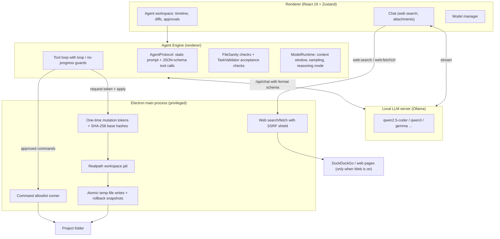

# ⚡ Emir Code

<div align="center">


### **A private AI coding assistant and agent that runs on your own computer**

[](https://github.com/daristanapeyvan/emircode/releases)
[](https://ollama.com)
[](./SECURITY.md)
[](./LICENSE)
[](#-privacy)

*Chat with local models, let an agent build and fix code in your project folder, and review every change — your code never leaves your machine.*

**🇹🇷 Türkçe kullanım kılavuzu: [docs/KULLANIM.md](./docs/KULLANIM.md)**

</div>

---

## ✨ What can you do with Emir Code?

Emir Code has two modes: **Chat** for questions and **Emir Code** (the agent) for work inside a project folder. You can write in Turkish or English — answers follow your language.

### 💬 Chat with a local model
- Ask coding questions and get explanations and code with syntax highlighting and one-click copy.
- Attach a text/code file or an image and ask about it (images need a vision-capable model).
- Switch on **Web** and ask about people, news, prices or the weather — Emir Code searches the web and answers with numbered sources:
  > `şebnem ferah kimdir?` · `bugün İstanbul'da hava nasıl?` · `What changed in React 19?`
- Choose a generation preset in Settings → Generation (Balanced, Precise, Creative, Coding) and a system prompt from the chat's system prompt button (General Assistant, Senior Developer, Ultra Concise), or write your own.

### 🤖 Let the agent do the work
Pick a project folder in the **Emir Code** tab, describe what you want, and follow the agent as it reads files, writes code, runs tests and reports back.

| You want to… | Example request |
| :--- | :--- |
| Build a web page | `Bir kahve dükkanı için tek sayfalık modern bir web sitesi oluştur: menü (en az 6 ürün, fiyatlarıyla), hakkımızda ve iletişim bölümleri olsun. Responsive olsun ve iletişim formu JavaScript ile doğrulansın.` |
| Change it afterwards | `başlıkların rengini koyu mavi yap ve sayfanın en altına telif yazısı olan bir footer ekle` |
| Write a script or CLI tool | `Python ile komut satırından çalışan bir yapılacaklar listesi yaz: ekle, listele, tamamla ve sil komutları olsun; veriler todos.json dosyasında saklansın.` |
| Fix a bug and prove it | `indirim uygulanınca sepet toplamı yanlış hesaplanıyor, düzelt ve npm test ile doğrula` |
| Edit configuration safely | `package.json dosyasına 'start' script'i olarak 'node src/index.js' ekle` |
| Repair a broken page | `Sitede script ve CSS etiketleri eksik kalmış, düzelt` |
| Understand a codebase | `src klasöründeki ödeme akışını adım adım açıkla` |

What happens behind the scenes:
1. The agent looks at your folder and plans; a request with several parts becomes a checklist.
2. Every file it writes is checked automatically (HTML, CSS, JS/TS, Python, JSON, YAML, Java, C#, Go, Rust…). Problems are sent back to the model with the exact line numbers until they are fixed.
3. Web pages must pass real acceptance checks before the task can finish: actual CSS rules, working JavaScript, a mobile viewport tag and linked files that exist. Existing tests are protected — a failing test is fixed in the code, never by editing the test.
4. You see every change as a line-by-line diff; depending on the security profile you approve it or it is applied for you.
5. The ↺ button undoes everything the agent changed in the session.
6. The next request in the same session knows what was asked and changed before, so "now add a footer" just works.

### 🧩 Manage your models
Download models from the built-in catalog or by name, see which models are loaded in memory, unload or delete them — no terminal needed (**Ctrl+Shift+M**).

### 🛡️ Stay in control
- **Security profiles** — *Strict* (default): you approve every change and command. *Balanced*: file changes are applied automatically; commands and deletions need your approval. *Autonomous*: file changes and test commands (`npm test`, `pytest`, `cargo test`) run automatically and the agent does not stop to ask questions; deleting files always needs your approval.
- The agent can only touch files inside the folder you picked. Writes go through one-time tokens checked by Electron's main process.
- Only `npm test`/`npm run <test|build|lint|typecheck|check>`, `node`, `python`, `pytest` and `cargo` can be run — never `npx` or arbitrary shell commands.

**Keyboard shortcuts:** Ctrl+N new chat (new agent task in the Emir Code tab) · Ctrl+K command palette · Ctrl+Shift+M models · Ctrl+, settings.

---

## 🧪 Which model should I use?

Measured with the built-in agent benchmark (`scripts/agent-e2e.ts`) on a CPU-only laptop (AMD Ryzen 5 7530U, 16 GB RAM, no GPU):

| Model | Download | Agent results | Recommendation |
| :--- | :---: | :--- | :--- |
| `qwen2.5-coder:7b` | 4.7 GB | Web page ✅ 3.5–10 min · follow-up edit ✅ 9 min · bug fix + `npm test` ✅ 3.3 min · `package.json` edit ✅ 4.7 min · Python CLI tested with real arguments ✅ 9.6 min | **Best balance** — recommended default |
| `qwen3:8b` | 5.2 GB | Web page ✅ 14.5 min · bug fix ✅ 5.5 min · Python CLI ✅ 28 min | **Most thorough**, 2–3× slower on CPU; reasoning mode in Settings → Generation |
| `gemma2:2b` | 1.6 GB | Page repair ✅ 2.3 min · new web page ✅ 3.7 min in the latest run, but inconsistent across runs | **Chat and small edits**; too small for reliable multi-step agent work |

With a GPU every step is many times faster. **Settings → Generation** controls the context window and the output limit; *Auto* picks values for your hardware.

---

## 🚀 Getting Started

### Prerequisites
1. **Operating system**: Windows 10/11 (64-bit) or Linux (64-bit: Ubuntu 20.04+, Debian 11+, Fedora 38+, Linux Mint, Pop!_OS, openSUSE, Arch).
2. **[Ollama](https://ollama.com)** installed with at least one model:
   ```bash
   ollama pull qwen2.5-coder:7b
   ```
   Emir Code starts the local Ollama service automatically when it is installed but not running.

### Installation
Pre-built packages for every release are on the [GitHub Releases](https://github.com/daristanapeyvan/emircode/releases) page.

#### 🪟 Windows

| Package | File | Description |
| :--- | :--- | :--- |
| **Setup (recommended)** | `Emir.Code.Setup.X.Y.Z.exe` | Installer with folder selection, Desktop and Start Menu shortcuts. |
| **Portable** | `Emir.Code.X.Y.Z.exe` | Single executable, no installation. |

#### 🐧 Linux

| Package | Install |
| :--- | :--- |
| **Debian / Ubuntu / Mint / Pop!_OS** (`emir-code_X.Y.Z_amd64.deb`) | Double-click it, or `sudo apt install ./emir-code_X.Y.Z_amd64.deb` |
| **Fedora / RHEL / openSUSE** (`emir-code-X.Y.Z.x86_64.rpm`) | Double-click it, or `sudo dnf install ./emir-code-X.Y.Z.x86_64.rpm` |
| **AppImage, any distribution** (`Emir.Code-X.Y.Z.AppImage`) | `chmod +x Emir.Code-X.Y.Z.AppImage && ./Emir.Code-X.Y.Z.AppImage` — AppImages need FUSE 2: `sudo apt install libfuse2t64` (Ubuntu 24.04) or `libfuse2` (22.04) |
| **Setup wizard** (`emir-code-setup-linux.sh`) | `bash emir-code-setup-linux.sh` — installs to `~/.local/share/emir-code` with menu entry, desktop shortcut, `emir-code` command and `uninstall.sh`. Downloads the matching `.tar.gz` automatically if it is not next to the script. |
| **Archive** (`emir-code-X.Y.Z.tar.gz`) | Extract and run `./emir-code` |

When started from an AppImage or an extracted folder, **Settings → About → "Masaüstü Kısayollarını Oluştur / Güncelle"** adds Emir Code to the application menu and desktop.

On distributions that block Chromium's sandbox for normal users (Ubuntu 23.10+ restricts unprivileged user namespaces with AppArmor), the `emir-code` launcher starts the app without the sandbox automatically instead of failing to start. Every release is launched in CI from each Linux package format (see [ARCHITECTURE.md §13](./ARCHITECTURE.md#13-packaging--release-pipeline)).

### First steps
1. Open Emir Code, pick a model in the model selector at the top.
2. **Chat**: type a question. Turn on **Web** for questions about current information.
3. **Emir Code tab**: choose a project folder (an empty folder is fine for new projects), pick a security profile and describe your task.
4. Follow the timeline; open the 💡 panel to see the model's reasoning and raw output.

### Troubleshooting
- **The first agent step is slow** — the model is loaded and the whole task is read once (on CPU this can take 1–3 minutes). Later steps reuse Ollama's cache and are much faster.
- **The agent stopped with "DÖNGÜ TESPİT EDİLDİ" / "İLERLEME YOK"** — the model repeated itself; rephrase the request more concretely or try a larger model.
- **The taskbar still shows an old icon after updating** — Windows caches icons; unpin and re-pin the app, or sign out and back in.
- **No answer from Ollama** — check that `ollama serve` is running and that the endpoint in Settings → Ollama is `http://localhost:11434`.

---

## 🏛️ Architecture Overview



The full technical description — reliability layer, security model and release pipeline — is in [ARCHITECTURE.md](./ARCHITECTURE.md).

---

## 🛠️ Building from Source

Requires Node.js 20+ (CI uses Node 22) and npm.

```bash
git clone https://github.com/daristanapeyvan/emircode.git
cd emircode
npm install

# Development mode (Vite + Electron)
npm run dev

# Regression suites: functional, agent reliability, architecture, web access
npm test

# Windows installer + portable exe (release/)
npm run build:installer

# Linux packages: deb, rpm, AppImage, tar.gz
npm run build:linux

# Agent benchmark against a local Ollama model (see the file header for scenarios)
node ./scripts/run-ts-test.mjs scripts/agent-e2e.ts qwen2.5-coder:7b web-new
```

Pushing a `vX.Y.Z` tag runs the release workflow, which builds all packages, launches the Linux packages in a virtual display and publishes the GitHub release.

---

## 🔒 Privacy

- **No telemetry**: no analytics, no tracking, no accounts.
- **Local inference**: prompts and code go only to your Ollama endpoint (`http://localhost:11434` by default).
- **Web access is the only network feature** besides Ollama. It is switched on by default and can be turned off completely or per mode (chat / agent) in Settings → Web Access. Searches go to DuckDuckGo; with Web access off, nothing leaves your computer.

---

## 📜 Documentation

- **[Kullanım Kılavuzu (docs/KULLANIM.md)](./docs/KULLANIM.md)**: Türkçe kullanım rehberi ve örnek istekler.
- **[Workflow Examples (docs/EXAMPLES.md)](./docs/EXAMPLES.md)**: step-by-step walkthroughs of typical tasks.
- **[System Architecture (ARCHITECTURE.md)](./ARCHITECTURE.md)**: processes, agent loop, reliability layer, packaging.
- **[Security Model (docs/SECURITY_MODEL.md)](./docs/SECURITY_MODEL.md)**: jail, tokens, profiles, web shield.
- **[Security Policy (SECURITY.md)](./SECURITY.md)**: how to report vulnerabilities.
- **[Contributing (CONTRIBUTING.md)](./CONTRIBUTING.md)**: development setup, tests and conventions.
- **[Changelog (CHANGELOG.md)](./CHANGELOG.md)**: release history.
- **[License (LICENSE)](./LICENSE)**: MIT.

---

## 👥 Authors

Created and maintained by **Agah Emir**. Built with Electron, React, TypeScript, Tailwind CSS and Ollama.
