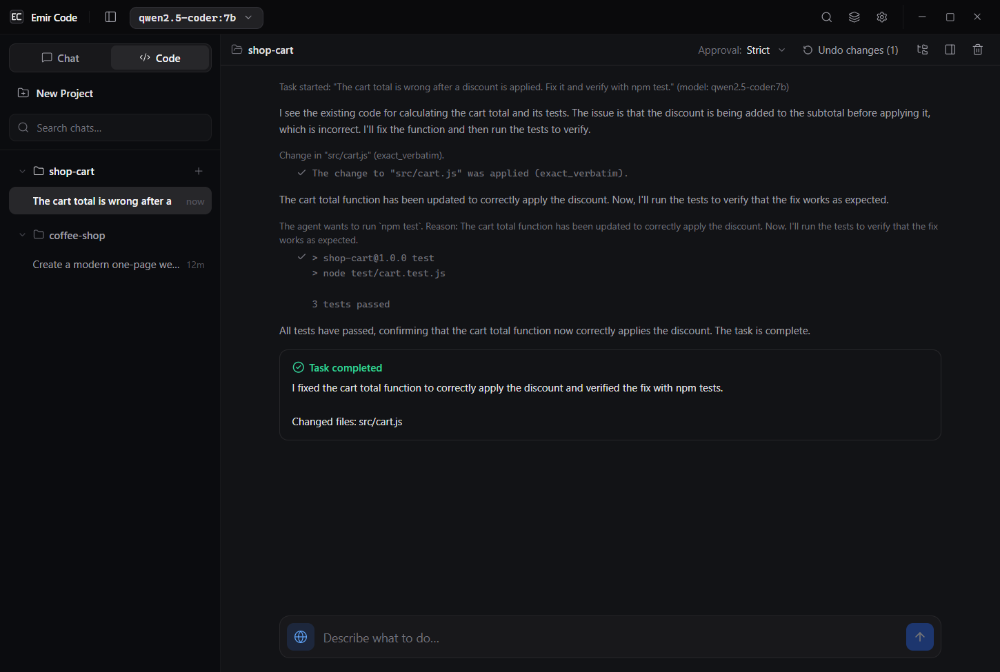
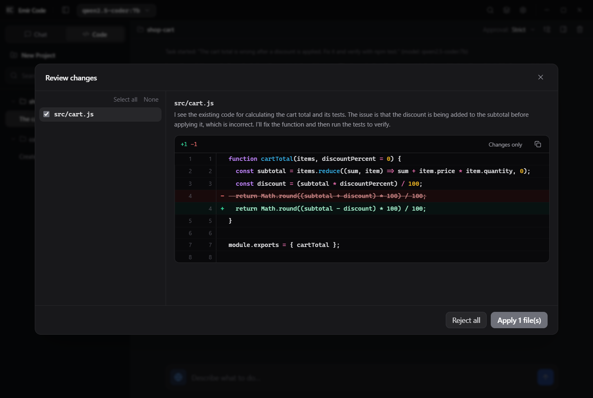
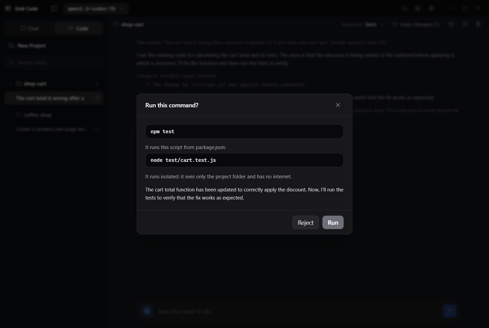
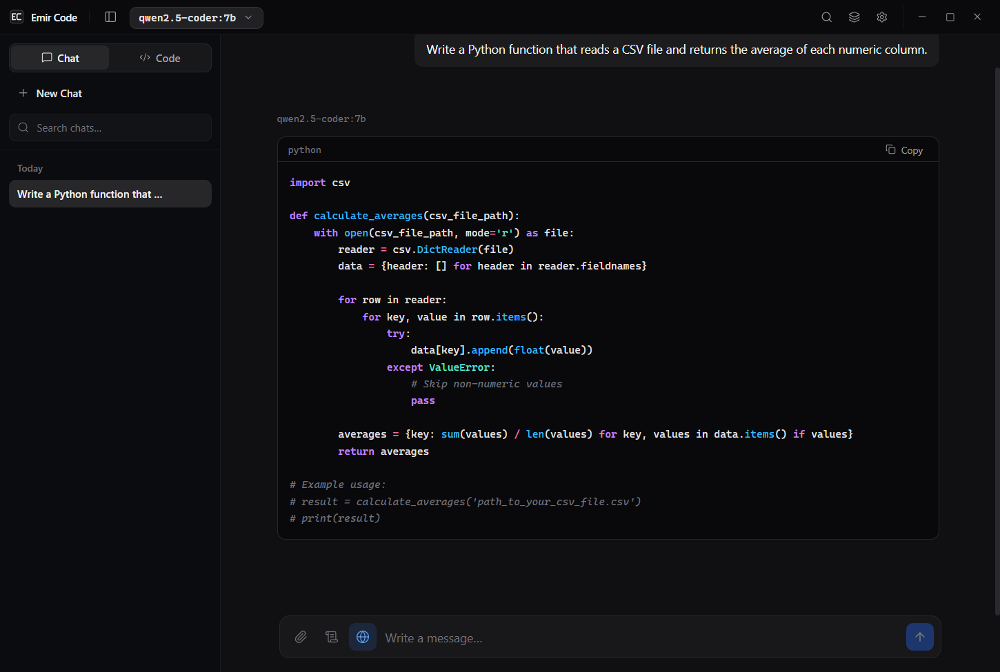
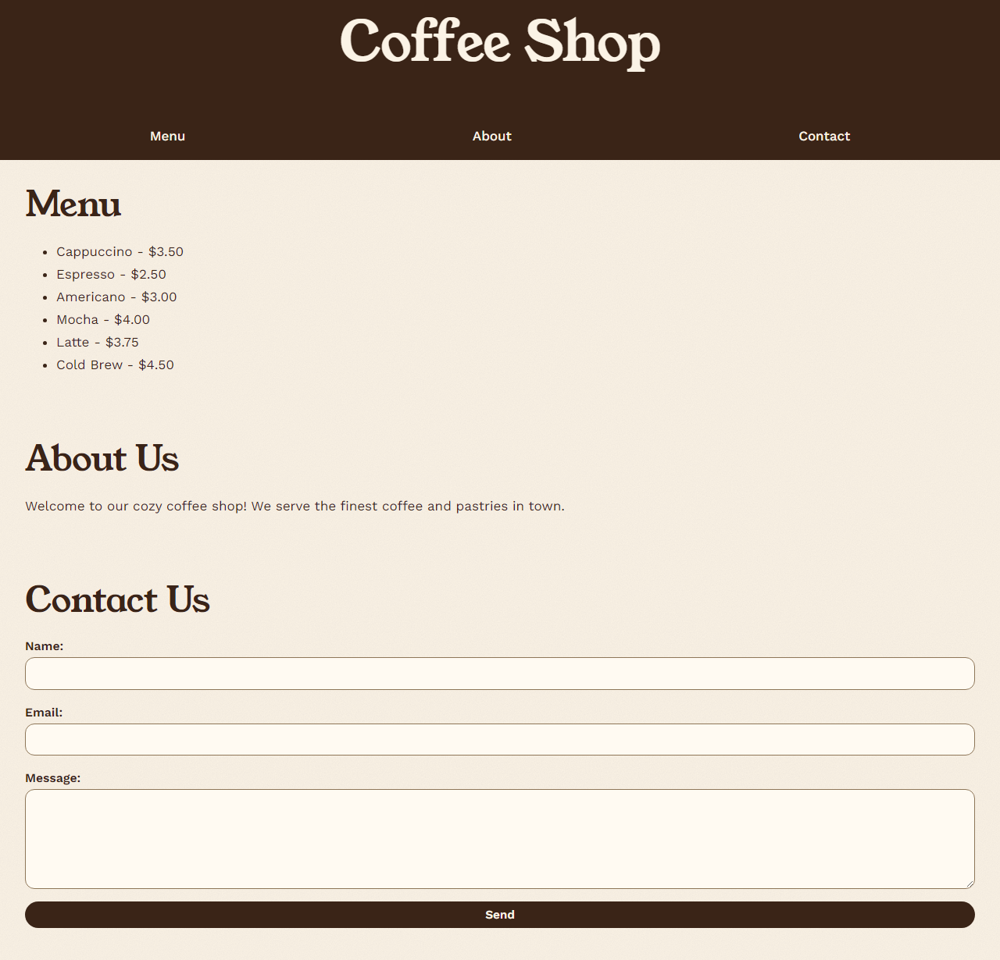
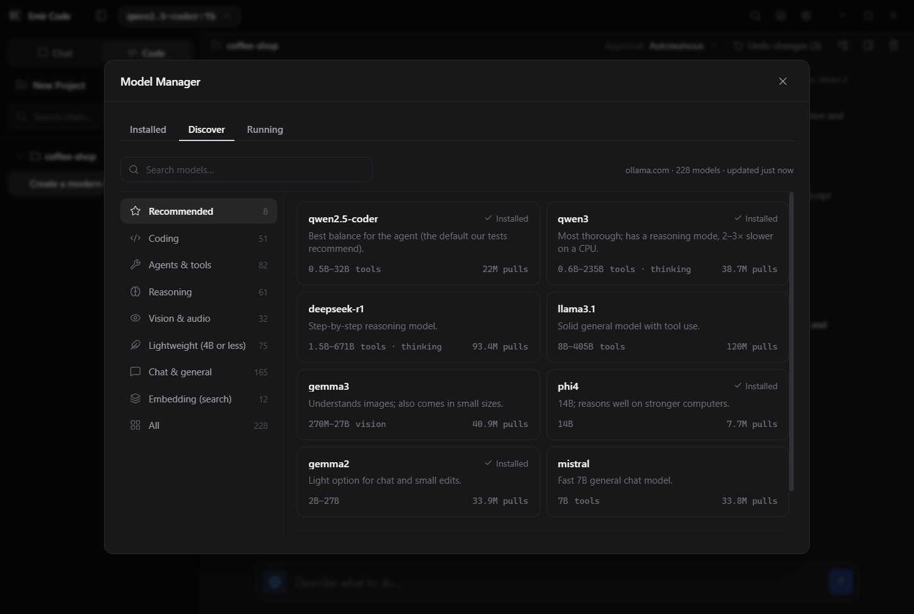
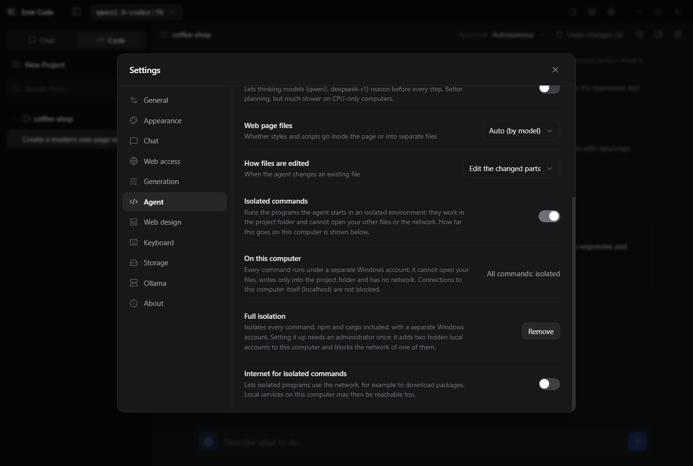
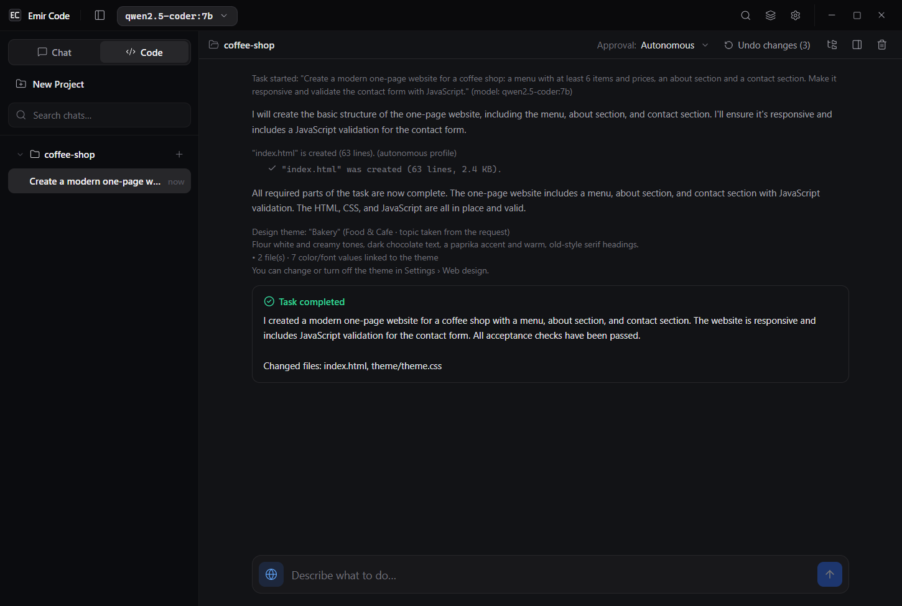
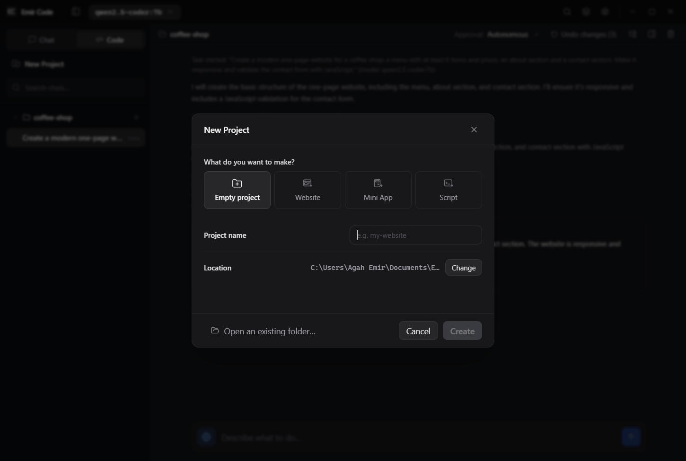

<div align="center">


# Emir Code

**AI models on your own computer: chat with one, or let a coding agent build and fix your project while you review every change.**

[](https://github.com/daristanapeyvan/emircode/releases/latest)
[](https://github.com/daristanapeyvan/emircode/releases)
[](https://github.com/daristanapeyvan/emircode/actions/workflows/build.yml)
[](./LICENSE)

[⬇️ Download](https://github.com/daristanapeyvan/emircode/releases/latest) · [🚀 Get started](#-get-started) · [🇹🇷 Türkçe kılavuz](./docs/KULLANIM.md) · [📝 What's new](./CHANGELOG.md)



<sub>A real run: "The cart total is wrong after a discount is applied. Fix it and verify with npm test." Solved by <code>qwen2.5-coder:7b</code> on a laptop without a GPU in 83 seconds.</sub>

</div>

Emir Code is a desktop app for Windows and Linux. It runs models through [Ollama](https://ollama.com) on your machine, with no account and no telemetry.

## ✨ What you get

| | |
| :--- | :--- |
| 💬 **Chat** | Ask questions, attach files or images, get code with syntax highlighting. |
| 🛠️ **Code agent** | Describe a task; the agent reads files, writes code and runs tests in your project folder. |
| 👀 **You stay in control** | Every change is shown as a diff. You choose how much the agent may do without asking. |
| 🔒 **Isolated commands** | Programs the agent runs are kept away from your other files and from the network, as far as your system provides it. |
| 🧙 **Wizards** | Website, Mini App and Script wizards turn a few choices into a detailed request. |
| 📦 **Model manager** | Browse the Ollama library, see what fits your memory, download and verify. |
| 🌐 **Web when you want it** | Current questions are searched and the page is read; switch it off any time. |
| 🌍 **English and Turkish** | The interface comes in both; write requests in any language your model understands. |

## 📸 A quick look

| 👀 Every change as a diff | ▶️ Commands say what they will run |
| :---: | :---: |
|  |  |
| 💬 **Chat** | 🌍 **A page the agent built** |
|  |  |
| 📦 **Model manager** | 🔒 **Isolation settings** |
|  |  |

All screenshots are from real runs with `qwen2.5-coder:7b`; nothing in them is staged.

## 🚀 Get started

**1. Install Ollama and a model.** Get [Ollama](https://ollama.com), then:

```bash
ollama pull qwen2.5-coder:7b
```

The setup wizard on first start checks Ollama and Node.js and can install them for you. If Ollama is installed but not running, Emir Code starts it. Node.js 18 or newer is optional; the agent needs it to run `npm` commands in your projects.

**2. Download Emir Code** from the [Releases page](https://github.com/daristanapeyvan/emircode/releases/latest).

| System | File | How |
| :--- | :--- | :--- |
| 🪟 Windows (recommended) | `Emir.Code.Setup.X.Y.Z.exe` | Installer: choose the folder, Desktop and Start Menu shortcuts |
| 🪟 Windows, portable | `Emir.Code.X.Y.Z.exe` | Runs without installation |
| 🐧 Debian, Ubuntu | `emir-code_X.Y.Z_amd64.deb` | `sudo apt install ./emir-code_X.Y.Z_amd64.deb` |
| 🐧 Fedora, openSUSE | `emir-code-X.Y.Z.x86_64.rpm` | `sudo dnf install ./emir-code-X.Y.Z.x86_64.rpm` |
| 🐧 Any Linux | `Emir.Code-X.Y.Z.AppImage` | `chmod +x` and run it. Needs FUSE 2 (`libfuse2t64` on Ubuntu 24.04, `libfuse2` on 22.04) |
| 🐧 Any Linux | `emir-code-setup-linux.sh` | `bash emir-code-setup-linux.sh` installs to `~/.local/share/emir-code` with a menu entry, a desktop shortcut, the `emir-code` command and `uninstall.sh` |
| 🐧 Any Linux | `emir-code-X.Y.Z.tar.gz` | Extract it and run `./emir-code` |

**3. Open it.**

1. Pick a model in the selector in the title bar.
2. **Chat:** type a question. Switch on **Web** (the globe) for questions about current events.
3. **Code:** press **New Project** or open a folder, choose the approval level in the project bar and describe the task.

<details>
<summary>Linux notes</summary>

- Settings › About › Create shortcuts adds Emir Code to the application menu, the desktop and `~/.local/bin`.
- Where Chromium's sandbox cannot start (AppImage and archive copies on systems that restrict user namespaces, such as Ubuntu 23.10 and later), the `emir-code` launcher starts the app with `--no-sandbox` instead of failing. See [docs/SECURITY_MODEL.md](./docs/SECURITY_MODEL.md#linux-sandbox-fallback).
- The release workflow launches every Linux package on Ubuntu in a separate job, which reports problems without blocking the release.

</details>

## 💬 Chat

- Ask coding questions; code blocks have syntax highlighting and a copy button.
- Attach a text or code file, or an image, and ask about it. Images need a model that accepts image input.
- 🌐 With **Web** on, questions about current information (people, news, prices, weather) are searched on DuckDuckGo first, the first result page is read, and the answer is written from them. The message shows what was searched and read.
- Programming questions are answered by the model itself and go to the web only when you ask ("search the web for…").
- If a model still replies that it cannot go online, the app runs the search and generates the answer again.
- Settings › Generation holds the sampling of the open chat, with the presets Balanced, Precise, Creative and Coding. The **System instructions** button in the message box offers General assistant, Senior developer and Very concise, or your own text.

## 🛠️ Code: the agent

Start a **New Project** in the sidebar or open a folder you already have, describe what you want, and follow the agent as it reads files, writes code and runs tests. The sidebar lists your tasks by project folder; the **+** next to a project starts a new task in it.

<p align="center"><br /><sub>The first request of the table below, finished in 3 minutes 40 seconds; the page it produced is in the gallery above.</sub></p>

| You want to… | Example request |
| :--- | :--- |
| 🌍 Build a web page | `Create a modern one-page website for a coffee shop: a menu with at least 6 items and prices, an about section and a contact section. Make it responsive and validate the contact form with JavaScript.` |
| 🎨 Change it afterwards | `Make the headings dark blue and add a footer with a copyright notice.` |
| ⌨️ Write a command-line tool | `Write a command-line to-do list in Python with add, list, done and delete commands. Store the data in todos.json.` |
| 🐞 Fix a bug and prove it | `The cart total is wrong after a discount is applied. Fix it and verify with npm test.` |
| ⚙️ Edit configuration | `Add a "start" script to package.json that runs node src/index.js.` |
| 🩹 Repair a broken page | `The page lost its script and stylesheet tags. Fix it.` |
| 🔎 Understand a codebase | `Explain the payment flow in the src folder step by step.` |

<details>
<summary><b>How a task runs</b></summary>

1. The agent looks at the folder and works step by step. A request written as a numbered or bulleted list, or with steps joined by "then" / "sonra", becomes a checklist that has to be completed in full. Any other request is treated as one task, however many sentences it has.
2. Every file the agent writes is checked (HTML, CSS, JavaScript/TypeScript, Python, JSON, YAML, Java, C#, Go, Rust and more). Problems go back to the model with line numbers.
3. A web page task is reported as completed only when the page has real CSS, working JavaScript where the request needs it, a mobile viewport tag and only links to files that exist; when you ask for working menu links, every menu link must also lead somewhere. Otherwise the model is sent back to fix it, and if it still fails the task ends as incomplete with the failing checks listed.
4. An edit that would break a working file is not applied. Existing tests cannot be changed unless you ask for it, so a failing test has to be fixed in the code.
5. You see each change as a line-by-line diff. Depending on the approval level you approve it, or it is applied for you.
6. A follow-up request in the same session knows which files the previous request changed, so "now add a footer" works on the right file. When it continues the earlier work ("continue", "fix those too"), it also gets the previous request.
7. **Undo changes (n)** in the project bar restores every file the agent changed in the session, including edits you made to those files afterwards. The previous contents are kept in memory, so undo is available only until Emir Code is closed.

</details>

## 🧙 Creation wizards

**New Project** offers an empty project or one of three wizards. The project folder is created when you confirm the wizard.

<p align="center"></p>

- 🌍 **Website:** pages, sections, your own texts, contact details, interactions and a design theme. The app turns your answers into a detailed request with a page plan.
- 🧮 **Mini App:** 21 small single-file web tools in 5 categories (calculators, productivity, tracking, utilities, fun & learning), each with its own settings page.
- 📜 **Script:** 13 command-line scripts in Python or Node.js in 3 categories (files & folders, data, text). Scripts only preview by default and change files only with `--apply`; they never delete or overwrite a file, back up files before changing them and log every action.

Confirming a wizard puts the request into the message box; nothing runs until you press send. New web pages the agent creates get one of 24 design themes after the agent has finished (Settings › Web design).

## 📦 Models

The Model Manager (**Ctrl+Shift+M**) lists the Ollama library from ollama.com by category (Recommended, Coding, Agents & tools, Reasoning, Vision & audio, Lightweight, Chat & general, Embedding). You can pick a size and quantization, see whether it fits this computer's memory and download it. Tags are checked against the Ollama registry before and after the download, and installed models show whether an update is available. The window also shows which models are loaded in memory and lets you unload or delete them.

**Which model to use.** Results of the agent benchmark (`scripts/agent-e2e.ts`) on a laptop without a GPU (AMD Ryzen 5 7530U, 16 GB RAM). Times depend on the hardware; with a GPU every step is much faster.

| Model | Download | Results | Use it for |
| :--- | :---: | :--- | :--- |
| `qwen2.5-coder:7b` | 4.7 GB | Web page 3.5–10 min · follow-up edit 9 min · bug fix with `npm test` 3.3 min · `package.json` edit 4.7 min · Python CLI tested with real arguments 9.6 min | ⭐ Agent tasks (recommended) |
| `qwen3:8b` | 5.2 GB | Web page 14.5 min · bug fix 5.5 min · Python CLI 28 min | Careful work; 2–3× slower on a CPU |
| `gemma2:2b` | 1.6 GB | Page repair 2.3 min · new web page 3.7 min in the latest run, inconsistent across runs | Chat and small edits |

All listed runs passed their checks. Settings › Agent sets the context length, the maximum output per step and "Think before each step" for thinking models such as qwen3; *Auto* picks values for this computer.

## 🔒 Safety: approvals and isolation

**You decide how much the agent may do** (project bar, or Settings › General › Agent approvals):

| Level | File changes | Commands | Deleting a file |
| :--- | :--- | :--- | :--- |
| 🛡️ *Strict* (default) | You approve | You approve | You approve |
| ⚖️ *Balanced* | Applied | You approve | You approve |
| 🚀 *Autonomous* | Applied | Isolated commands run without asking | You approve |

Under Autonomous the agent also answers its own questions. A command that does not run isolated still asks, with one exception: a test command (`npm test`, `pytest`, `cargo test`) starts on its own until the task has written code. After that it asks too, because it would run that code.

**What the agent can touch:**

- 📁 Only files inside the project folder. `.env` files, `.git`, `node_modules`, build output folders, key or certificate files and package manager credentials (`.npmrc`, `.pypirc`, `.netrc` and similar) are off limits.
- ▶️ Only these commands: `npm test`, `npm run test|build|lint|typecheck|check`, `node`, `python`, `pytest` and `cargo`. `npx`, shell commands, npm options, code written on the command line (`node -e`, `python -c`) and `python -m pip` are blocked.
- 🔗 Links in chat answers open in your browser.

**Isolated commands** (Settings › Agent, on by default): programs the agent runs work in the project folder, cannot open your other files and have no network unless you allow it. The approval dialog says how each command runs.

| System | What runs isolated |
| :--- | :--- |
| 🐧 Linux | Every command, in bubblewrap, when it is installed |
| 🪟 Windows with **Full isolation** set up | Every command, under a separate Windows account. Set it up once in Settings › Agent, with administrator approval |
| 🪟 Windows without it | Python and `node` scripts run isolated. npm, cargo and test runners run *write-protected*: they cannot change anything outside the project, but they can read your files and use the network |

The details and the limits that remain are in [docs/SECURITY_MODEL.md](./docs/SECURITY_MODEL.md).

## ⌨️ Keyboard shortcuts

| Shortcut | Action |
| :--- | :--- |
| `Ctrl+N` | New chat (in the Code tab: new task in the open project) |
| `Ctrl+Shift+N` | New project |
| `Ctrl+K` | Command palette |
| `Ctrl+Shift+M` | Models |
| `Ctrl+,` | Settings |

## 🩺 Troubleshooting

<details>
<summary><b>The first agent step is slow</b></summary>

The model is loaded and reads the whole task once; on a CPU this can take 1–3 minutes. Later steps reuse Ollama's cache.
</details>

<details>
<summary><b>The task stopped because the model repeated itself or made no progress</b></summary>

Write the request more concretely (file names, expected result) or try a larger model.
</details>

<details>
<summary><b>The approval dialog says a command runs write-protected</b></summary>

On Windows, npm, cargo and test runners start other programs, which only a separate account can isolate. Settings › Agent › Full isolation › **Set up** creates that account after a Windows administrator prompt (two hidden local accounts and a network block for one of them; **Remove** deletes them again). Until then such commands cannot change anything outside the project, but they can read your files and use the network.
</details>

<details>
<summary><b>The task ended with an amber card</b></summary>

The agent finished, but some automatic checks did not pass; the card lists them. Continue in the same session, for example "also fix: …".
</details>

<details>
<summary><b>The taskbar shows an old icon after an update</b></summary>

Windows caches icons; unpin and pin the app again, or sign out and back in.
</details>

<details>
<summary><b>No answer from Ollama</b></summary>

Check that Ollama is running and that Settings › Ollama › Ollama address is correct (default `http://localhost:11434`).
</details>

The **Logs** panel (button in the project bar) shows the agent's events and the model's raw output.

## 🔐 Privacy

- 🚫 No telemetry, analytics or accounts. Chats, settings and tasks are stored on this computer (`emir_code_data.json` in the app's data folder).
- 🏠 Prompts and code go only to the Ollama address in Settings (`http://localhost:11434` by default).
- 🌐 Emir Code connects to the internet only for:
  - web access, which is on by default and can be switched off completely or separately for chat and the agent in Settings › Web access. Searches go to DuckDuckGo; chat reads the first result page and the agent can open web pages. Addresses on this computer or the local network are never opened;
  - the Model Manager, which reads the model list from ollama.com and checks tags with registry.ollama.ai (the source `ollama pull` uses) while its Discover or Installed tab is open;
  - the setup wizard, when you ask it to download Ollama or Node.js;
  - on Windows with full isolation set up, one connection attempt to `1.1.1.1` from the isolated account when the app checks the isolation, to see that it is blocked. Nothing is sent.
- 🔤 Pages the agent creates with a design theme load their fonts from Google Fonts unless Settings › Web design › Web fonts is off.

## 🧑‍💻 Building from source

Requires Node.js 20 or newer (CI uses Node.js 22) and npm.

```bash
git clone https://github.com/daristanapeyvan/emircode.git
cd emircode
npm install
npm run dev              # Vite + Electron in development mode
npm test                 # all regression suites
npm run test:sandbox     # the isolated environment of commands, tried for real on this system
npm run build:installer  # Windows installer and portable exe in release/
npm run build:linux      # Linux packages: deb, rpm, AppImage, tar.gz
```

The agent benchmark runs against a local Ollama model; the scenarios are listed at the top of `scripts/agent-e2e.ts`:

```bash
node ./scripts/run-ts-test.mjs scripts/agent-e2e.ts qwen2.5-coder:7b web-new
```

Pushing a `vX.Y.Z` tag starts the release workflow: it builds the Windows and Linux packages, launches the Linux packages in a virtual display and publishes the GitHub release.

## 📚 Documentation

| | |
| :--- | :--- |
| 🇹🇷 [docs/KULLANIM.md](./docs/KULLANIM.md) | Turkish user guide |
| 🧪 [docs/EXAMPLES.md](./docs/EXAMPLES.md) | What happens during typical agent tasks |
| 🏗️ [ARCHITECTURE.md](./ARCHITECTURE.md) | Processes, agent loop, checks, themes, wizards, model library, packaging |
| 🔒 [docs/SECURITY_MODEL.md](./docs/SECURITY_MODEL.md) | What the app allows and blocks, and where the limits are |
| 🚨 [SECURITY.md](./SECURITY.md) | How to report a vulnerability |
| 🤝 [CONTRIBUTING.md](./CONTRIBUTING.md) | Development setup, tests and conventions |
| 📝 [CHANGELOG.md](./CHANGELOG.md) | Release history |

---

<div align="center">

Emir Code is written by Agah Emir and released under the [MIT License](./LICENSE).

</div>
