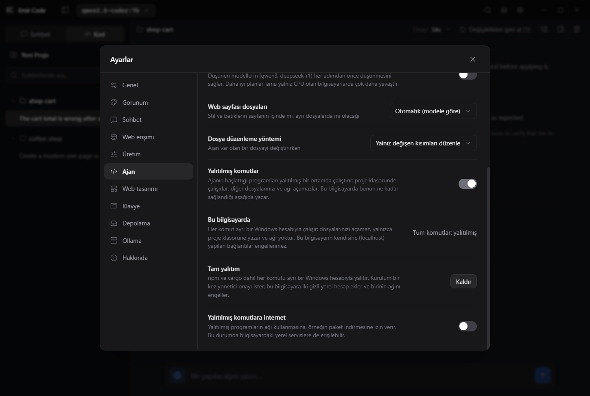
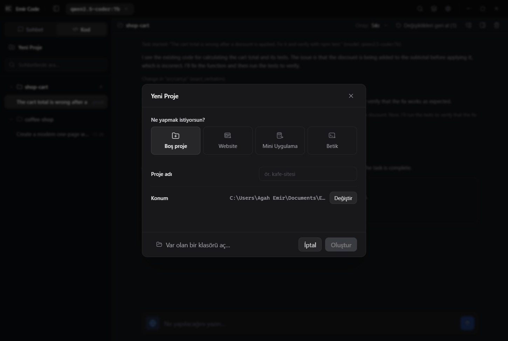
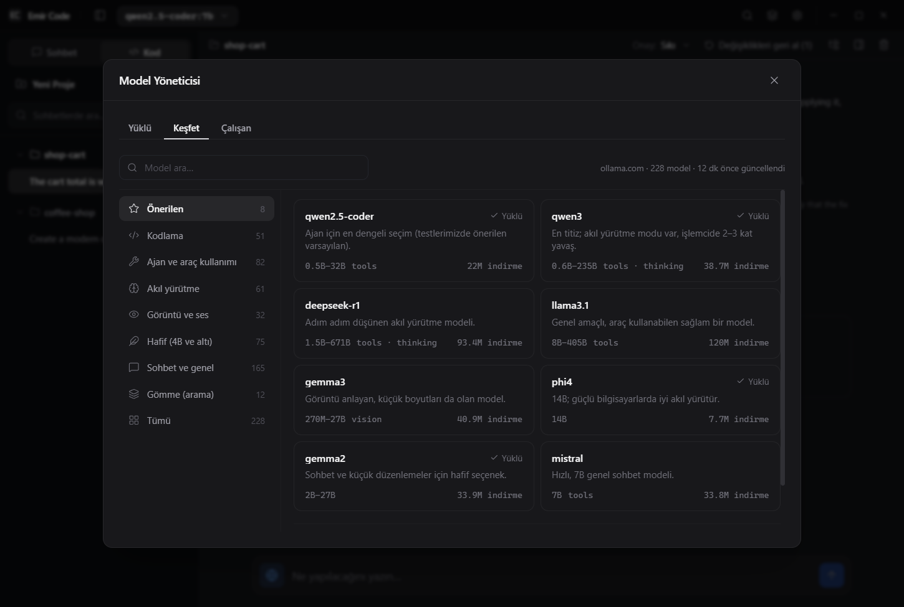

# Emir Code Kullanım Kılavuzu

Emir Code, yapay zekâ modellerini Ollama ile kendi bilgisayarınızda çalıştıran bir masaüstü uygulamasıdır. Modelle sohbet edebilir ya da bir proje klasöründe kod yazan, hata düzelten ve test çalıştıran bir ajan kullanabilirsiniz. Varsayılan olarak istekleriniz ve kodunuz yalnızca bilgisayarınızdaki Ollama'ya gider.

İsterseniz yerel modellerin yanında **bulut modellerini** de kullanabilirsiniz: **Ollama Cloud** (ollama.com'daki büyük açık modeller), **Claude** (Anthropic), **GPT** (OpenAI), **Gemini** (Google), **Mistral** ya da OpenRouter, Groq, LM Studio gibi **OpenAI uyumlu bir sunucu**. Bunun için kendi API anahtarınızı girersiniz; bir bulut modeli seçtiğinizde istekleriniz o sağlayıcıya gider (bkz. [Bulut modelleri](#bulut-modelleri)).

---

## Kurulum

1. [ollama.com](https://ollama.com) adresinden Ollama'yı indirip kurun.
2. Bir model indirin. Bunu terminalden ya da Emir Code'un Model Yöneticisi'nden (`Ctrl+Shift+M`) yapabilirsiniz:
   ```bash
   ollama pull qwen2.5-coder:7b
   ```
   Bu model yaklaşık 4,7 GB'tır; indirme süresi bağlantınıza bağlıdır.
3. [Sürümler sayfasından](https://github.com/daristanapeyvan/emircode/releases) Emir Code'u indirin: Windows için `Emir.Code.Setup.X.Y.Z.exe`, Linux için `.deb`, `.rpm`, `.AppImage` ya da `emir-code-setup-linux.sh`.
4. Uygulamayı açın ve başlık çubuğundaki model seçiciden modelinizi seçin.

İlk açılışta kurulum sihirbazı Ollama ile Node.js'i kontrol eder; eksik olanları sizin onayınızla resmî kaynaklardan indirip kurabilir. Ollama kurulu ama kapalıysa Emir Code onu kendisi başlatır. Node.js zorunlu değildir; ajanın projelerinizde `npm` komutları çalıştırabilmesi için gerekir.

**Ollama kurmadan başlamak:** Sihirbazdaki **Bulut modellerini ayarla** düğmesi Ayarlar › Bulut modelleri'ni açar. Claude, GPT ya da Ollama Cloud için API anahtarınızı girdiğinizde o sağlayıcının modelleri model seçicide görünür; Ollama olmadan da sohbet edebilir ve ajanı kullanabilirsiniz.

---

## Sohbet

Kenar çubuğunun üstünden **Sohbet** ile **Kod** arasında geçersiniz.

| Ne yapmak istiyorsunuz? | Örnek |
| :--- | :--- |
| Kod açıklatmak | `Bu fonksiyon ne işe yarıyor?` (ardından kodu yapıştırın) |
| Hata mesajı çözdürmek | `"TypeError: Cannot read properties of undefined" hatası neden olur, nasıl düzeltirim?` |
| Kod yazdırmak | `Python'da bir CSV dosyasını okuyup sütun ortalamalarını hesaplayan fonksiyon yaz` |
| Güncel bilgi sormak (Web açıkken) | `Linus Torvalds kimdir?` · `Node.js'in güncel LTS sürümü hangisi?` |
| Dosya veya görsel hakkında sormak | Ataş düğmesiyle bir dosya ya da görsel ekleyip `bu dosyadaki hataları bul` |

- Mesaj kutusundaki **Web** (dünya simgesi) açıkken güncel bilgi gerektiren sorular (kişiler, haberler, fiyatlar, hava durumu) önce DuckDuckGo'da aranır, ilk sonucun sayfası okunur ve cevap bunlardan yazılır; mesajda neyin arandığı ve okunduğu görünür. Programlama soruları modelin kendisi tarafından cevaplanır; webde aranmalarını istiyorsanız bunu açıkça söyleyin ("webde ara: …"). Model yine de "internete erişimim yok" derse uygulama aramayı kendisi yapar ve cevabı yeniden üretir.
- Açık sohbetin üretim ayarları Ayarlar › Üretim'dedir. Hazır önayarlar: Dengeli, Kesin, Yaratıcı, Kodlama.
- Mesaj kutusundaki **Sistem yönergeleri** düğmesinde Genel asistan, Kıdemli geliştirici ve Çok kısa hazır gelir; kendi yönergenizi de yazabilirsiniz.
- Görsel sorabilmek için görsel girdisini destekleyen bir model gerekir (ör. `llama3.2-vision`, `gemma3`, Claude modelleri ya da `gpt-4o`, `gpt-5` gibi GPT modelleri).
- Bulut modeliyle verilen cevapların altında kullanılan token sayısı da yazar (giriş, önbellekten okunan kısım ve çıkış); sağlayıcılar ücreti buna göre alır.

---

## Kod sekmesi (ajan)

Kod sekmesinde **Yeni Proje** ile yeni bir proje başlatın ya da **Var olan bir klasörü aç…** ile elinizdeki bir projeyi açın, sonra ne istediğinizi yazın. Ajan dosyaları okur, kod yazar, gerekirse test çalıştırır ve sonucu özetler.

### Projeler ve görevler
- **Yeni Proje** (`Ctrl+Shift+N`) penceresinde ne yapmak istediğinizi (Boş proje, Website, Mini Uygulama, Betik), proje adını ve konumu seçersiniz. Konum varsayılan olarak Belgeler klasöründeki "Emir Code Projeleri"dir; **Değiştir** ile başka bir yer seçebilirsiniz, son seçtiğiniz konum hatırlanır.
- Boş proje **Oluştur**'a bastığınızda açılır. Sihirbaz seçtiyseniz klasör, sihirbazda **Onayla**'ya bastığınızda oluşturulur; sihirbazı yarıda kapatırsanız diskte bir şey kalmaz. Aynı adda dolu bir klasör varsa kullanılmaz, uyarı çıkar.
- Görevler proje klasörlerine göre gruplanır; en son kullandığınız proje en üsttedir, açık proje kalın yazılır.
- Proje adının yanındaki **+** o projede yeni görev açar (açık projede her zaman, diğerlerinde fareyle üzerine gelince görünür). `Ctrl+N` açık projede yeni görev açar.
- Proje adına tıklamak listeyi daraltır ya da açar. Her projede son 5 görev görünür, gerisi "… tane daha göster" ile açılır. Görevin yanında ne zaman üzerinde çalışıldığı yazar (ör. `5 dk`, `2 g`); çalışan görevde dönen bir simge görünür.
- Taşınmış ya da silinmiş klasörler soluk ve uyarı işaretiyle gösterilir. Klasörü kaydedilmemiş eski görevler "Klasörsüz" altında toplanır.
- Çalışan bir görevden başka bir göreve ya da projeye geçerken görevin durdurulup durdurulmayacağı sorulur.
- **Dosyalar** paneli başta kapalıdır; proje çubuğundaki ağaç simgesiyle açılır ve seçiminiz hatırlanır.
- Sohbet sekmesinde yalnızca sohbetler, tarihe göre listelenir.

### Örnek istekler

| Ne yapmak istiyorsunuz? | Örnek istek |
| :--- | :--- |
| Web sitesi yapmak | `Bir kahve dükkânı için tek sayfalık modern bir web sitesi oluştur: menü (en az 6 ürün, fiyatlarıyla), hakkımızda ve iletişim bölümleri olsun. Duyarlı (responsive) olsun ve iletişim formu JavaScript ile doğrulansın.` |
| Sonradan değişiklik istemek | `Başlıkların rengini koyu mavi yap ve sayfanın en altına telif yazısı olan bir footer ekle.` |
| Komut satırı aracı yazmak | `Python ile komut satırından çalışan bir yapılacaklar listesi yaz: ekle, listele, tamamla ve sil komutları olsun; veriler todos.json dosyasında saklansın.` |
| Hata düzeltip testle doğrulamak | `İndirim uygulanınca sepet toplamı yanlış hesaplanıyor; düzelt ve npm test ile doğrula.` |
| Ayar dosyası düzenlemek | `package.json dosyasına node src/index.js çalıştıran bir start betiği ekle.` |
| Bozuk bir sayfayı onarmak | `Sayfada script ve CSS etiketleri eksik kalmış, düzelt.` |
| Projeyi anlamak | `src klasöründeki ödeme akışını adım adım açıkla.` |

### Görev nasıl yürür?
1. Birden fazla ayrı iş istiyorsanız bunları numaralı ya da madde işaretli liste olarak yazın veya "sonra" ile bağlayın; ajan bunları eksiksiz tamamlaması gereken bir kontrol listesine alır. Bunun dışındaki her istek, kaç cümle olursa olsun tek görev sayılır.
2. Ajanın yazdığı her dosya otomatik kontrol edilir (HTML, CSS, JavaScript/TypeScript, Python, JSON, YAML, Java, C#, Go, Rust ve diğerleri). Kapanmamış parantez, bozuk girinti, yarım kalmış dosya ya da "içerik buraya gelecek" gibi yer tutucular satır numarasıyla modele bildirilir.
3. Web sayfası isteklerinde görev ancak sayfada gerçek CSS kuralları, istek etkileşim gerektiriyorsa çalışan JavaScript, mobil görünüm (viewport) etiketi ve var olan dosyalara giden bağlantılar varsa "tamamlandı" sayılır. Menü bağlantılarının çalışmasını istediğinizde her bağlantının bir bölüme, sayfaya ya da JavaScript işlevine gittiği de kontrol edilir. Eksik kalırsa model düzeltmeye geri gönderilir; yine olmazsa görev, geçmeyen kontroller listelenerek "eksik" biter.
4. Çalışan bir dosyayı bozacak değişiklik uygulanmaz. `package.json` gibi dosyalarda mevcut anahtarlar silinmez, bozuk JSON yazılmaz. Siz istemedikçe mevcut testler değiştirilemez; test başarısızsa ajan kodu düzeltmek zorundadır.
5. Model aynı adımı tekrarlarsa uyarılır. Art arda 3 tekrar ya da 10 adım boyunca ilerleme olmazsa görev bir mesajla durdurulur; otomatik kontrollerin hepsi o ana kadar geçmişse görev bir notla tamamlanmış sayılır.
6. Aynı oturumdaki bir sonraki istek, öncekinde hangi dosyaların değiştiğini bilir; "şimdi stil ekle" demeniz yeterlidir. Önceki işi sürdürmesini istediğinizde ("devam et", "onları da düzelt") önceki isteği de görür.

Ajan çalışırken mesaj kutusuna yeni bir talimat yazıp **Talimatı gönder** ile araya girebilirsiniz; talimat çalışan göreve eklenir.

### Değişiklikleri siz kontrol edersiniz
- Her değişiklik satır satır fark (diff) olarak gösterilir. Sıkı profilde hangi dosyaların uygulanacağını seçebilirsiniz.
- Proje çubuğundaki **Değişiklikleri geri al (n)** düğmesi, ajanın o oturumda değiştirdiği tüm dosyaları önceki hâline döndürür; bu dosyalarda sonradan sizin yaptığınız değişiklikler de geri alınır. **Silmeden önce sor** açıksa önce onay istenir. Önceki içerikler bellekte tutulduğu için geri alma yalnızca Emir Code kapanana kadar mümkündür.
- **Kayıtlar** paneli (proje çubuğundaki panel düğmesi) ajanın olaylarını ve modelin ham çıktısını gösterir.

### Onay seviyeleri
Proje çubuğundaki **Onay** seçicisinden ya da Ayarlar › Genel › Ajan onayları'ndan seçilir.

| Seviye | Dosya değişiklikleri | Komutlar | Dosya silme | Ajan soru sorar mı? |
| :--- | :--- | :--- | :--- | :--- |
| Sıkı (varsayılan) | Sizin onayınızla | Sizin onayınızla | Sizin onayınızla | Evet |
| Dengeli | Onay istenmeden | Sizin onayınızla | Sizin onayınızla | Evet |
| Otonom | Onay istenmeden | Yalıtılmış çalışan komutlar onay istenmeden. Yalıtılmış çalışmayan test komutları (`npm test`, `pytest`, `cargo test`) yalnızca görev henüz kod yazmamışken onay istenmeden; sonrasında ve diğer komutlarda sizin onayınızla | Sizin onayınızla | Hayır, kendisi karar verir |

Hiçbir seviyede ajan proje klasörünün dışına yazamaz. `.env` dosyaları, `.git`, `node_modules`, derleme çıktı klasörleri, anahtar ve sertifika dosyaları ile paket yöneticisi kimlik bilgileri (`.npmrc`, `.pypirc`, `.netrc` ve benzerleri) ajana kapalıdır. Çalıştırabileceği komutlar yalnızca `npm test`, `npm run test|build|lint|typecheck|check`, `node`, `python`, `pytest` ve `cargo`'dur; `npx`, kabuk komutları, npm seçenekleri, komut satırına yazılmış kod (`node -e`, `python -c`) ve `python -m pip` engellenir. Onay penceresinde bir npm komutunun `package.json` içindeki hangi betiği çalıştıracağı da yazar.

### Yalıtılmış komutlar
Ayarlar › Ajan › **Yalıtılmış komutlar** (varsayılan olarak açık) ajanın çalıştırdığı programları yalıtılmış bir ortamda başlatır: program proje klasöründe çalışır, diğer dosyalarınızı açamaz ve **Yalıtılmış komutlara internet** açılmadıkça ağa bağlanamaz. Bunun bu bilgisayarda ne kadar sağlandığı aynı sayfadaki **Bu bilgisayarda** satırında yazar; onay penceresi de her komutun nasıl çalışacağını söyler.

| Nasıl çalışır? | Proje dışındaki dosyalar | Ağ |
| :--- | :--- | :--- |
| Yalıtılmış | Okuyamaz, yazamaz | Kapalı (izin vermedikçe) |
| Yazma korumalı (yalnızca Windows) | Okuyabilir, yazamaz | Açık |
| Yalıtımsız | Sizin programlarınız gibi | Açık |

<p align="center"></p>

**Windows'ta tam yalıtım.** Ayarlar › Ajan › Tam yalıtım › **Kur** düğmesi, Windows yönetici onayından sonra bilgisayara iki gizli yerel hesap (`EmirCodeSandbox`, `EmirCodeSandboxNet`) ve bir grup (`EmirCodeSandboxUsers`) ekler, ilk hesabın ağını engeller (Windows güvenlik duvarı kapalı olsa da geçerli olan bir filtre ve bir güvenlik duvarı kuralıyla). Bundan sonra `npm` ve `cargo` dahil her komut bu ayrı hesapla çalışır: profilinizi (Belgeler, Masaüstü, uygulama verileri, anahtarlar) açamaz, yalnızca proje klasörüne yazar ve ağı kesilir. **Kaldır** düğmesi hepsini siler; Emir Code'u kaldırmadan önce buradan kaldırın.

Tam yalıtımın sınırları:
- Bilgisayarın kendisine yapılan bağlantılar (localhost; ör. Ollama ya da yerel bir veritabanı) engellenmez.
- Bilgisayardaki her hesabın erişebildiği yerler erişilebilir kalır: Windows ve kurulu programlar okunabilir, `C:\ProgramData` gibi ortak yerlere ve erişim kurallarında "Users" ya da "Everyone" bulunan klasörlere yazılabilir. Projenin bulunduğu klasör böyleyse onay penceresi uyarır.

**Windows'ta kurulum yapılmamışsa:** Python, `pytest` ve `node dosya.js` yalıtılmış çalışır (AppContainer; ağ tamamen kapalıdır). `npm`, `cargo` ve test çalıştırıcıları yazma korumalı çalışır: proje dışında hiçbir şeyi değiştiremezler, ama dosyalarınızı okuyabilir ve ağı kullanabilirler. Python yalıtılmış programların okuyamadığı bir klasöre kuruluysa (ör. `C:\Python314`) o da yazma korumalı çalışır; **Python** satırındaki **İzin ver** düğmesi, yönetici onayından sonra klasöre gereken okuma iznini verir.

**Linux:** `bwrap` (bubblewrap) kuruluysa her komut yalıtılmış çalışır. İnternet izni açıkken program bilgisayarın ağını olduğu gibi kullanır; yerel servisler de erişilebilir olur.

Ayrıntılar ve sınırlar: [SECURITY_MODEL.md](./SECURITY_MODEL.md#isolated-environment-of-commands) (İngilizce).

---

## Oluşturma sihirbazları

Sihirbazlar **Yeni Proje** penceresinde türü seçince açılır: Website, Mini Uygulama ya da Betik. Proje klasörü sihirbazı onayladığınızda oluşturulur.

<p align="center"></p>

Hiçbir sihirbaz görevi kendiliğinden başlatmaz. **Onayla**'ya bastığınızda hazırlanan istek mesaj kutusuna gelir ve üstünde küçük bir etiket görünür. İsteği okuyabilir, değiştirebilir ya da ek isteklerinizi yazabilirsiniz; gönder düğmesine siz basarsınız. Etiketteki **Sihirbazı aç** seçtiğiniz ayarlara geri götürür, **×** isteği kaldırır. İsteği düzenleseniz de seçtiğiniz tema, sayfa planı ve kontroller istekle birlikte gider.

### Website Oluştur
Birkaç soruyla sitenizi tarif edersiniz; uygulama cevaplarınızdan ayrıntılı bir istek hazırlar. Sihirbazın üstünden iki mod arasında istediğiniz an geçebilirsiniz:

| Mod | Adımlar |
| :--- | :--- |
| Basit | Site (ad, tür, kısa tanım) › Tasarım › Yapı (tek sayfa ya da çok sayfalı, bölümler) › Özet |
| Kapsamlı | Site (slogan, hedef kitle, sayfa dili ve yazım tonu dahil) › Tasarım › Sayfalar & İçerik › İletişim › İşlevler › Özet |

- **Sayfalar & İçerik:** Sayfa ekleyip çıkarabilir, adlarını ve sıralarını değiştirebilirsiniz. Her sayfaya bölüm eklenir (Karşılama, Hakkımızda, Hizmetler, Menü, Galeri, Fiyatlar, Yorumlar, SSS, İletişim ve diğerleri). Bir bölüme kendi metninizi yazarsanız sayfaya aynen konur; boş bıraktığınız bölümlerin metnini ajan yazar.
- **Metin kutusu:** Araç çubuğunda kalın, italik, ara başlık, madde listesi, numaralı liste, alıntı ve bağlantı vardır (kısayollar: Ctrl+B, Ctrl+I, Ctrl+K). Listede Enter yeni madde açar, boş maddede Enter listeyi bitirir. **Önizleme** ile sonucu görebilirsiniz.
- **Tasarım:** Konunuza uyan temalar önerilir; 24 temanın hepsi küçük önizlemeleriyle listelenir. "Tema kullanma" seçilirse modelin kendi tasarımı kalır.
- **İşlevler:** İletişim formu, mobil menü, yumuşak kaydırma, açılır SSS, yukarı çık düğmesi, belirme animasyonları, açık/koyu düğmesi, WhatsApp düğmesi, harita, galeri büyütme ve bülten kutusu. Ayrıca görsel türünü (renkli yer tutucular ya da örnek fotoğraflar) ve SEO başlığı ile açıklamasını seçersiniz.
- **Özet:** Seçimlerinizi ve proje klasörünü gösterir; klasör boş değilse uyarır.

Çok sayfalı sitelerde her sayfa kontrol listesinde ayrı bir madde olur; mesaj kutusunda bir sayfayı istekten silerseniz o sayfa listeden de çıkar. Taslağınız otomatik kaydedilir, sihirbazı kapatsanız ya da uygulamadan çıksanız da kaybolmaz. **Sıfırla** ile baştan başlarsınız.

### Mini Uygulama
Tek dosyalık (`index.html`) küçük web araçları hazırlar. Harici kütüphane kullanmazlar ve çift tıklayınca tarayıcıda açılırlar.

1. Soldan bir kategori seçin.
2. Aracın kartına tıklayın; aracın kendi ayar sayfası açılır.
3. Anahtarları, seçimleri, sayıları ve listeleri ayarlayın.
4. **Çıktı** bölümünde uygulamanın adını, arayüz dilini ve tasarım temasını seçin. Tema varsayılan olarak aracın türüne uygun olandır.
5. **Geri** ile kataloğa dönersiniz; ayarlarınız kaybolmaz.

| Kategori | Araçlar |
| :--- | :--- |
| Hesaplama | Hesap Makinesi, Birim Çevirici, Kredi Hesaplayıcı, Hesap Bölüşme, Tarih Hesaplayıcı |
| Verimlilik | Pomodoro Zamanlayıcı, Yapılacaklar Listesi, Not Defteri, Geri Sayım & Kronometre |
| Takip | Harcama Takibi, Alışkanlık Takibi, VKİ Hesaplayıcı |
| Yardımcı Araçlar | Şifre Üretici, Renk Paleti Üretici, Metin Araçları, Rastgele Seçici |
| Eğlence & Öğrenme | Bilgi Yarışması, Bilgi Kartları, Yazma Hızı Testi, Hafıza Oyunu, Yılan Oyunu |

Her aracın isteğinde küçük modellerin sık yaptığı hatalara karşı kurallar vardır: hesap makinesinde `eval` kullanılmaz, şifreler ve çekilişler güvenli rastgelelikle üretilir, zamanlayıcılar sekme arka plandayken de doğru sayar, para ve tarih biçimi tarayıcının dil ve bölge ayarından gelir.

### Betik
Dosyalarınız üzerinde çalışan komut satırı araçları hazırlar. Betikler Python (yalnızca standart kütüphane) ya da Node.js (yalnızca yerleşik modüller) ile yazılır.

| Kategori | Betikler |
| :--- | :--- |
| Dosya & Klasör | Toplu Yeniden Adlandırma, Klasör Düzenleyici, Yinelenen Dosya Bulucu, Klasör Yedekleme (ZIP), Klasör Boyutu Raporu |
| Veri | CSV Birleştirme, CSV ↔ JSON Dönüştürücü, CSV Özet Raporu, JSON Doğrulayıcı & Biçimlendirici |
| Metin | Toplu Bul & Değiştir, Dosyalarda Ara, E-posta & Bağlantı Ayıklayıcı, Kelime Sıklığı Analizi |

Dosya değiştiren her betikte şu kurallar geçerlidir:
- Betik varsayılan olarak yalnızca önizleme yapar: ne yapacağını listeler, hiçbir şeyi değiştirmez. Değişiklik için `--uygula` eklenir (İngilizce arayüzde `--apply`).
- Hiçbir dosya silinmez ya da üzerine yazılmaz. İçeriği değişecek dosyalar önce `_yedek_…` klasörüne kopyalanır.
- Betik verilen klasörün dışına çıkmaz.
- Her işlem `islem_kaydi.csv` dosyasına yazılır. Taşıma ve adlandırma betiklerinde **Geri alma** ayarını açarsanız `--geri-al` son çalıştırmayı geri alır.

Bu kuralları uygulayan hazır bir modül (`guvenli_islem.py` ya da `.js`, İngilizce arayüzde `safe_actions`) isteği gönderdiğinizde betiğin yanına yazılır; Sıkı profilde bunun için onayınız istenir, aynı adda bir dosya varsa ona dokunulmaz. Ajan yalnızca betiğin kendisini yazar (seçenekler ve hangi dosyaya ne yapılacağının listesi); dosyalara modül dokunur. Betiği başka bir yere taşırsanız modülü de yanında taşıyın.

**Örnek veriyle dene** açıksa ajan betiği yazdıktan sonra küçük bir `ornek_veri` klasörü oluşturur, betiği bu klasörde çalıştırır ve sonucu kontrol eder; komutları çalıştırmak için izniniz istenir. Toplu Yeniden Adlandırma'da kalıbın örnek dosya adlarına etkisini ayar sayfasında hemen görürsünüz; kalıpta `{ad}`, `{uzanti}`, `{sayac:03}` ve `{tarih}` kullanılabilir.

---

## Web tasarım temaları

Ajan yeni bir web sayfası oluşturduğunda, işini bitirdikten sonra sayfaya bir tasarım teması uygulanır. Model tema dosyalarını görmez ve onlarla uğraşmaz.

Tema uygulandığında:
- Proje klasörüne `theme/theme.css` yazılır ve sayfaya bağlanır. Dosyada renkler, yazı tipleri ve buton, form, tablo, kart ve bölüm boşlukları için temel stiller bulunur.
- Sayfanın renkleri ve yazı tipleri temadaki karşılıklarına bağlanır; koyu ya da renkli alanlardaki yazılar okunur kalır.
- Özellik kartlarındaki ve iletişim satırlarındaki simge olarak kullanılmış emojiler SVG simgelere dönüşür.

Tema kullanılsın ya da kullanılmasın, ajanın yazdığı sayfalarda şunlar da düzeltilir:
- Footer'daki eski telif yılı güncel yılla değiştirilir; eksik viewport etiketi eklenir.
- Telefonda açılmayan ya da bağlantı seçilince kapanmayan hamburger menü onarılır. Zaten çalışan menülere dokunulmaz.
- Tema ve temel CSS kullanılmıyorsa, hiçbir CSS kuralının biçimlendirmediği butonlara sayfanın vurgu renginde sade bir görünüm verilir.

24 tema, 8 kategoride toplanır: Kurumsal, Lüks, Eğlenceli, Teknoloji, Doğa & Sağlık, Yemek & Kafe, Yaratıcı ve Genel. Her temanın kendi renkleri, yazı tipi eşleşmesi, köşe ve gölge biçimi, buton stili, arka plan dokusu ve simge çizgisi vardır. Tüm temalarda metin kontrastı en az 7:1'dir (WCAG AAA).

**Tema nasıl seçilir?** Sitenin konusu isteğinizdeki kelimelerden anlaşılır (ör. "kafe" › Yemek & Kafe). Konu belirsizse ya da birden fazla konu eşleşirse model, ilk adımından önce kısa bir soruyu cevaplar ("bu hangi tür site?"). "Koyu tema" ya da "dark mode" derseniz koyu temalardan biri seçilir.

**Tema ne zaman uygulanmaz?**
- Klasörde zaten bir site varsa (mevcut tasarım korunur).
- React, Tailwind, Bootstrap gibi bir framework istediyseniz.
- "Tek dosya", "sadece HTML" gibi bir kısıt verdiyseniz.
- Kendi renklerinizi belirttiyseniz ("mavi tonlarında", "#1e3a8a"). Bu durumda yalnızca temel stil kullanılır. Kendi yazı tipinizi belirttiyseniz yazı tiplerine dokunulmaz.

**Ayarlar › Web tasarımı**

| Ayar | Seçenekler |
| :--- | :--- |
| Tasarım teması | Konuya göre (önerilen), Rastgele, Sabit tema (önizlemeli seçim), Kapalı |
| Temel CSS | Otomatik (8B altındaki modellerde açık), Açık, Kapalı |
| Web yazı tipleri (Google Fonts) | Açık: yazı tipleri Google Fonts'tan yüklenir. Kapalı: yalnızca cihazdaki yazı tipleri kullanılır, sayfa dışarıya bağlanmaz. |

Tasarım teması ve Temel CSS ikisi de kapalıyken sayfaya tema dosyası eklenmez.

Temanın renklerini değiştirmek için `theme/theme.css` dosyasının başındaki `:root` değişkenlerini düzenleyebilirsiniz (ör. `--theme-accent`). Sayfanın kendi CSS'i her zaman önceliklidir. `theme/theme.css` silinirse sayfa, modelin yazdığı orijinal renklere döner.

---

## Model indirme

`Ctrl+Shift+M` ile açılan Model Yöneticisi'nin **Keşfet** sekmesi, Ollama kütüphanesini ollama.com'dan kendiliğinden getirir.

<p align="center"></p>

- **Kategoriler:** Önerilen (ajan testlerimizde kullanılan modeller), Kodlama, Ajan ve araç kullanımı, Akıl yürütme, Görüntü ve ses, Hafif (4B ve altı), Sohbet ve genel, Gömme (arama), **Bulut (ollama.com)** ve Tümü. Üstteki kutudan ada ya da açıklamaya göre arayabilirsiniz. Yalnızca ollama.com bulutunda çalışan modeller yalnızca Bulut kategorisinde ve aramada görünür.
- **Bulut etiketleri:** Bir modelin sayfasındaki **Bulut** grubu, ollama.com'da çalışan etiketleri (ör. `gpt-oss:120b-cloud`) listeler. **Ekle** yalnızca küçük bir kayıt indirir; model bilgisayarınızda değil ollama.com'da çalışır. Bunun için Ollama'nızda bir kez `ollama signin` ile oturum açmış olmanız gerekir (bkz. [Bulut modelleri](#bulut-modelleri)).
- **Boyut:** Bir modele tıklayınca tüm boyutları görünür (ör. qwen3 için 0.6B'den 235B'ye). Bu bilgisayarda rahat çalışan en büyük boyut önceden seçilidir.
- **Nicemleme:** Varsayılan (Q4_K_M) ile daha doğru ama daha büyük seçenekler (Q5_K_M, Q6_K, Q8_0, FP16) dosya boyutları ve kısa açıklamalarıyla listelenir. Her satırda "Rahat çalışır", "Sınırda: yavaş çalışabilir" ya da "Belleğe sığmaz" yazar. Seyrek nicemlemeler ve diğer sürümler **Diğer sürümler** altındadır.
- **Doğrulama:** Seçtiğiniz etiket, Ollama'nın indirme yaptığı kayıt deposunda kendiliğinden kontrol edilir ve kesin boyutu gösterilir. İndirme bitince model depodakiyle karşılaştırılır. **Yüklü** sekmesi her modelin güncel olup olmadığını gösterir; yeni sürüm varsa **Güncelle** düğmesi çıkar.
- Listede olmayan bir modeli ya da etiketi (ör. `qwen3:14b-q8_0`) alttaki kutuya yazabilirsiniz; indirmeden önce kontrol edilir.
- İnternet yoksa en son alınan liste, o da yoksa kısa bir yerleşik liste gösterilir. Liste 12 saatte bir yenilenir.

**Çalışan** sekmesi bellekte yüklü modelleri gösterir; buradan bir modeli bellekten çıkarabilirsiniz.

---

## Hangi modeli seçmeliyim?

Ajan testlerinin (`scripts/agent-e2e.ts`) GPU'suz bir dizüstü bilgisayardaki (Ryzen 5 7530U, 16 GB RAM) sonuçları. Süreler donanıma göre değişir; GPU varsa her adım çok daha hızlıdır.

| Model | Boyut | Sonuç | Ne için? |
| :--- | :---: | :--- | :--- |
| `qwen2.5-coder:7b` | 4,7 GB | Web sitesi 3,5–10 dk · hata düzeltme ve test 3,3 dk · ayar dosyası 4,7 dk · Python komut satırı aracı (gerçek komutlarla test ederek) 9,6 dk | Ajan görevleri (önerilen) |
| `qwen3:8b` | 5,2 GB | Web sitesi 14,5 dk · hata düzeltme 5,5 dk · Python aracı 28 dk | Daha titiz iş; CPU'da 2–3 kat yavaş |
| `gemma2:2b` | 1,6 GB | Sayfa onarımı 2,3 dk · yeni web sitesi son denemede 3,7 dk, denemeden denemeye tutarsız | Sohbet ve küçük düzenlemeler |

Ayarlar › Ajan'dan bağlam uzunluğunu, adım başına en fazla çıktıyı ve qwen3 gibi düşünen modeller için "Adımlardan önce düşün" seçeneğini ayarlayabilirsiniz. "Otomatik", bu bilgisayara uygun değerleri seçer.

**Bilgisayarınız yavaşsa ya da büyük bir projede çalışıyorsanız** bir bulut modeli (Claude, GPT, Gemini, Mistral ya da `qwen3-coder:480b`, `gpt-oss:120b` gibi Ollama Cloud modelleri) çok daha hızlı ve isabetli olabilir; karşılığında istekleriniz ve ajanın okuduğu dosyalar sağlayıcıya gider ve kullanım, sağlayıcının koşullarına göre ücretlendirilir ya da sınırlanır. Ajan testleri bulut modelleriyle de çalışır (bkz. [CONTRIBUTING.md](../CONTRIBUTING.md#cloud-models-live-checks)); ölçülmüş bulut sonuçları gerçek anahtarlarla çalıştırıldıktan sonra bu tabloya eklenecek.

---

## Bulut modelleri

Yerel modellerin yanında, bir sağlayıcının sunucularında çalışan büyük modelleri de kullanabilirsiniz. Ayarları **Ayarlar › Bulut modelleri**'ndedir (komut paletinde "Bulut modelleri", model seçicide **Bulut modeli ekle**).

| Sağlayıcı | Ne sunar? | Ne gerekir? |
| :--- | :--- | :--- |
| Ollama Cloud | ollama.com'daki büyük açık modeller (`gpt-oss:120b`, `qwen3-coder:480b`, `deepseek-v3.1:671b` …) | API anahtarı (ollama.com › Settings › Keys) **ya da** Ollama'da `ollama signin` |
| Claude (Anthropic) | Claude modelleri (ör. `claude-opus-5-5`, `claude-sonnet-5-5`, `claude-haiku-4-5`) | Anthropic Console'dan API anahtarı |
| GPT (OpenAI) | Hesabınızın erişebildiği GPT ve o serisi modeller (ör. `gpt-5`, `gpt-4.1`) | OpenAI Platform'dan API anahtarı |
| Gemini (Google) | Gemini modelleri (ör. `gemini-2.5-pro`, `gemini-2.5-flash`) | Google AI Studio'dan Gemini API anahtarı |
| Mistral | Mistral, Codestral ve Magistral modelleri | Mistral Console'dan API anahtarı |
| OpenAI uyumlu sunucu | Sunucunun sunduğu modeller: OpenRouter, Groq, DeepSeek, Together ya da kendi bilgisayarınızdaki LM Studio, vLLM, llama.cpp | Adresi ve gerekiyorsa anahtarı |

### Anahtar ekleme
1. Ayarlar › Bulut modelleri'nde sağlayıcının **API anahtarı al** bağlantısından anahtarınızı oluşturun.
2. Anahtarı kutuya yapıştırıp **Kaydet**'e basın. Emir Code anahtarı sağlayıcının model listesini isteyerek dener; çalışmıyorsa kaydetmez ve nedenini yazar.
3. Sağlayıcının modelleri model seçicide kendi başlıkları altında bulut simgesiyle görünür. Çok model varsa seçicinin üstünde bir arama kutusu çıkar.

**Anahtarınız nerede durur?** Anahtarlar sohbetlerin ve ayarların saklandığı `emir_code_data.json` dosyasında **tutulmaz**; ayrı bir `cloud_keys.json` dosyasında, işletim sisteminin anahtar deposuyla (Windows'ta DPAPI, Linux'ta GNOME Keyring/KWallet) şifreli durur. Linux'ta bir anahtar deposu yoksa anahtar diske yazılmaz, Emir Code kapanana kadar bellekte kalır ve ayarlar bunu söyler. Arayüz anahtarı bir daha göremez; yalnızca son dört karakteri gösterilir. Sağlayıcının hata mesajlarında anahtara benzeyen her şey de maskelenir (`…abcd`). `ANTHROPIC_API_KEY`, `OPENAI_API_KEY`, `GEMINI_API_KEY`, `MISTRAL_API_KEY` ve `OLLAMA_API_KEY` ortam değişkenleri de, kayıtlı anahtar yoksa kullanılır. Ajanın çalıştırdığı komutlar bu değişkenleri almaz. **Kaldır** anahtarı unutur.

### Model seçicide hangi modeller görünür?
Sağlayıcılar onlarca model sunabilir; bu yüzden her sağlayıcı bir seçki gösterir: Claude'un en yeni üç modeli, OpenAI'ın en yeni beş sohbet modeli, Gemini'nin en yeni modelleri, Mistral'ın `-latest` modelleri, Ollama Cloud'un bütün modelleri ve az modelli bir sunucunun bütün modelleri. Sağlayıcının **Modelleri seç** düğmesiyle kutuları işaretleyerek değiştirebilirsiniz (**Önerilenler** varsayılana döner). Seçicinin araması ve komut paleti gizli modelleri de bulur; seçili model her zaman listede kalır.

### OpenAI uyumlu sunucular
OpenAI API'sini konuşan her sunucuyu ekleyebilirsiniz. **Hazır** düğmeleri OpenRouter, Groq, DeepSeek, Together, LM Studio, vLLM ve llama.cpp için adı ve adresi doldurur.

- **Adres kuralları:** Uzak sunucular `https://` ister. Düz `http://` yalnızca bu bilgisayar (`localhost`, `127.0.0.1`) için ve, "Bu sunucu yerel ağımda" işaretliyse, özel bir ağ adresi (`192.168.x.x`, `10.x.x.x`, `*.local` …) için kabul edilir. Adreste kullanıcı adı, parola, `?` ya da `#` olamaz.
- **Anahtar adrese bağlıdır:** Anahtar, ait olduğu adresle birlikte şifrelenir ve başka hiçbir adrese gönderilmez; yönlendirmeler izlenmez. Bir sunucunun adresi değiştirilemez: kaldırıp yeniden ekleyin.
- Uzak bir sunucu eklenirken Emir Code onay ister, çünkü istekleriniz ve ajanın okuduğu dosyalar oraya gider. Bu bilgisayardaki bir sunucu (LM Studio gibi) yerel sayılır: bulut simgesi ve ücret göstermez, ajan onu yerel bir model gibi boyutuna göre ayarlar.

### Ollama üzerinden Ollama Cloud (API anahtarsız)
Ollama kuruluysa bir terminalde bir kez `ollama signin` çalıştırın. Sonra Model Yöneticisi › Keşfet › **Bulut (ollama.com)** kategorisinden bir modelin bulut etiketini **Ekle**yin (ya da terminalde `ollama pull gpt-oss:120b-cloud`). Bu modeller model seçicide **Ollama Cloud (Ollama üzerinden)** başlığı altında görünür ve Ollama'nız üzerinden ollama.com'da çalışır. Ollama oturum açmamışsa Emir Code "ollama signin" gerektiğini söyler. Ollama Cloud'un saatlik ya da haftalık kullanım sınırı dolarsa mesaj bunu ve sağlayıcı bildiriyorsa sınırın ne zaman sıfırlanacağını yazar.

### Çaba ve akıl yürütme
- **Ajanın çabası** ve **Sohbette çaba** (Otomatik, Düşük, Orta, Yüksek, Çok yüksek, En yüksek): Claude'un çaba (effort) ayarına, OpenAI'ın akıl yürüten modellerinin akıl yürütme çabasına ve Gemini'nin düşünme düzeyine dönüşür. Her model desteklediği en yakın düzeyi alır; Otomatik sağlayıcının varsayılanını kullanır. Yüksek düzey daha titizdir ama daha yavaştır ve daha çok token harcar.
- **Akıl yürütme özetleri:** OpenAI'ın akıl yürüten modelleri (GPT-5, o serisi) Responses API üzerinden çalışır ve nasıl düşündüklerinin okunabilir özeti cevabın **Düşünme** bölümünde görünür.

### Maliyet ve görev bütçesi
- Cevaplar ve biten görevler kullandıkları token'ları ve **tahmini** ücreti gösterir. Ücret, Ayarlar › Bulut modelleri › **Fiyatlar** tablosundan (milyon token başına ABD doları: giriş, önbellekten giriş, çıkış) hesaplanır. Tablo uygulamayla gelir ama sağlayıcılar fiyatlarını değiştirir: **Düzenle** ile kendi fiyatınızı girin. Fiyatı bilinmeyen modelde yalnızca token sayıları görünür.
- Ollama Cloud token başına değil, kullanım sınırlı bir planla ücretlendirilir; yerel modeller ve bu bilgisayardaki sunucular ücretsizdir.
- **Görev bütçesi:** Bir görevin tahmini maliyeti bu tutara ulaşınca ajan yeni adım başlatmaz ve görevi "Görev bütçesi doldu" notuyla durdurur; o ana kadarki değişiklikler korunur. Bütçenin %80'i harcandığında bir uyarı görünür. Bütçe yalnızca fiyatı bilinen modellerde denetlenebilir.

### Ajan bulut modelleriyle nasıl çalışır?
- Bütün korumalar aynıdır: onay seviyeleri, dosya kontrolleri, yalıtılmış komutlar, geri alma.
- **Büyük modellere göre ayar:** Ajan küçük yerel modeller için ayarlanmıştı. Bir bulut modelinde (ya da 24B ve üzeri bir yerel modelde) daha fazla adım atar, dosyaları daha büyük parçalar hâlinde okur, birden çok dosyayı tek adımda okuyabilir (`read_files`), geçmişin daha büyük kısmını saklar ve küçük modeller için yazılmış ayrıntılı kurallar yerine "önce oku, sonra değiştir, sonra doğrula" çalışma düzenini alır. Yeni web sayfalarında temel stil katmanı bulut modellerine eklenmez; tasarım teması yine uygulanır.
- **Bağlam penceresi** bilgisayarınızın belleğine değil, Ayarlar › Bulut modelleri › **Bağlam penceresi** ayarına bağlıdır (Otomatik: 64K token, modelin sınırını aşmaz). Büyük pencere geçmişi daha az kısaltır ama her adım daha çok token harcar.
- Adım başına çıktı 16K tokene kadardır; cevap kesilirse ajan sınırı kendiliğinden yükseltir.
- **Adımlardan önce düşün** açıksa Claude modelleri düşünür ve düşüncelerinin özeti görünür; Gemini düşünce özetlerini gösterir; GPT'nin akıl yürüten modelleri (`gpt-5`, `o3` …) daha fazla akıl yürütme çabası kullanır.
- Claude isteklerinde, görevin değişmeyen başı sağlayıcının önbelleğinden okunur; OpenAI ve Gemini bunu kendiliğinden yapar. Bu, adım başına ücreti düşürür.
- Sağlayıcı güvenlik nedeniyle bir isteği reddederse (Claude'un bazı modellerinde sınıflandırıcılar bunu yapabilir) Anthropic isteği önerdiği başka bir modelde otomatik olarak yeniden dener; yine reddedilirse görev bir açıklamayla durur.
- Görev günlüğünün başında modelin nerede çalıştığı ve nelerin gönderildiği yazar.
- Ayarlar › Üretim'deki örnekleme değerleri (sıcaklık, top-p …) Ollama modellerine (Ollama Cloud dahil) ve OpenAI uyumlu sunuculara uygulanır; Claude, GPT, Gemini ve Mistral kendi varsayılanlarını kullanır.
- **Deneysel: yerel araç çağrıları.** Ayarlar › Bulut modelleri › Deneysel'den açılır. Ajanın eylemleri Claude ve GPT'ye JSON cevap yerine sağlayıcının kendi araç (tool) biçiminde gider; cevap yine ajanın anladığı eyleme çevrilir, onaylar ve denetimler aynen çalışır. Bu kipte Claude adımlardan önce düşünmez. Varsayılan olup olmayacağına ajan testleriyle yapılacak ölçüm karar verecek ([PLAN_ACIK_NOKTALAR.md](./PLAN_ACIK_NOKTALAR.md)).

### Bilgisayardan ne çıkar?
Bir bulut modeli seçtiğinizde mesajlarınız ve ekleriniz, Kod sekmesinde de ajanın okuduğu proje dosyaları, komut çıktıları ve web sonuçları sağlayıcıya (ya da eklediğiniz sunucuya) gönderilir ve onun koşullarına göre işlenir. Yerel modelleri kullanırken hiçbir şey değişmez: bir bulut modeli seçmedikçe sağlayıcıya istek gitmez (anahtarı kaydederken ve model listesini yenilerken yalnızca model listesi okunur). Emir Code'un kendisi telemetri göndermez.

### Elle doğrulama listesi
Yeni bir sürümde ya da bir sağlayıcının API'si değiştiğinde aşağıdakiler elle denenir (sonuçlar sürüm notlarına yazılır):
1. Anahtar kaydet → model listesi gelir; **Kaldır** → modeller seçiciden çıkar; uygulamayı kapatıp aç → kayıtlı anahtar yerindedir.
2. Yanlış anahtar → "kabul etmedi" mesajı; mesajda anahtarın kendisi görünmez.
3. Linux'ta anahtar deposu olmadan (ör. `--password-store=basic`) → "bu oturum için" notu; anahtar diske yazılmaz.
4. Sohbette görsel ekle (Claude, GPT, Gemini) → model görseli anlatır; cevabın altında token ve tahmini ücret görünür.
5. Kod sekmesinde küçük bir görev → onay penceresi, dosya kontrolleri ve görev kartındaki ücret; **Durdur** isteği hemen keser.
6. Görev bütçesi $0.05 → görev "Görev bütçesi doldu" ile durur, yapılan değişiklikler kalır.
7. Çaba Yüksek / Düşük ve akıl yürütme özetleri → GPT-5'te özet görünür, Claude'da düşünme özeti görünür.
8. LM Studio (`http://localhost:1234/v1`) ve OpenRouter (`https://openrouter.ai/api/v1`) ekle → modeller gelir, sohbet ve ajan çalışır; `http://` ile uzak adres reddedilir.
9. `ollama signin` olmadan bir `-cloud` etiketi → "ollama signin" mesajı; oturum açınca çalışır.
10. Deneysel yerel araç çağrıları açıkken Claude ve GPT ile bir görev → görev aynı biçimde tamamlanır.

Otomatik canlı denetim için `scripts/cloud-smoke.ts` ve kıyaslama için `scripts/agent-e2e.ts` kullanılır ([CONTRIBUTING.md](../CONTRIBUTING.md#cloud-models-live-checks)). Tasarım kararları [PLAN_BULUT_MODELLERI.md](./PLAN_BULUT_MODELLERI.md), yol haritası ve durumu [PLAN_ACIK_NOKTALAR.md](./PLAN_ACIK_NOKTALAR.md) belgesindedir.

---

## Kısayollar

| Kısayol | İşlev |
| :--- | :--- |
| `Ctrl+N` | Yeni sohbet (Kod sekmesinde açık projede yeni görev) |
| `Ctrl+Shift+N` | Yeni Proje |
| `Ctrl+K` | Komut paleti |
| `Ctrl+Shift+M` | Model Yöneticisi |
| `Ctrl+,` | Ayarlar |

---

## Sık sorulan sorular

**İlk adım neden uzun sürüyor?**
Model belleğe yüklenir ve görevin tamamını bir kez okur; GPU'suz bir bilgisayarda bu 1–3 dakika sürebilir. Sonraki adımlar Ollama'nın önbelleğini kullandığı için daha hızlıdır.

**Görev "Durduruldu: model aynı eylemleri … tekrarladı" ya da "hiçbir dosya değişmedi" mesajıyla bitti.**
Model kendini tekrar etmeye başladı ya da ilerleyemedi. İsteği daha somut yazın (dosya adı, beklenen sonuç) veya daha büyük bir model deneyin.

**Görev "Görev eksik tamamlandı" diye bitti.**
Ajan işi yaptı ama otomatik kontrollerin bir kısmı geçmedi; kartta hangilerinin geçmediği yazar. Aynı oturumda `şunu da düzelt: …` diyerek devam edebilirsiniz.

**Onay penceresinde "Yazma korumalı çalışır" yazıyor.**
Windows'ta `npm`, `cargo` ve test çalıştırıcıları başka programlar başlatır; bunları ancak ayrı bir hesap yalıtabilir. Ayarlar › Ajan › Tam yalıtım › **Kur** bu hesabı oluşturur (bkz. Yalıtılmış komutlar). O zamana kadar bu komutlar proje dışında hiçbir şeyi değiştiremez, ama dosyalarınızı okuyabilir ve ağı kullanabilir.

**Uygulamayı kapatıp açtım, "Değişiklikleri geri al" çalışmıyor.**
Önceki dosya içerikleri yalnızca bellekte tutulur ve uygulama kapanınca silinir. Geri almayı uygulamayı kapatmadan yapın; kalıcı bir geri dönüş noktası için projede git kullanın.

**Güncellemeden sonra görev çubuğunda hâlâ eski simge görünüyor.**
Windows simgeleri önbellekte tutar. Uygulamayı görev çubuğundan kaldırıp yeniden sabitleyin ya da oturumu kapatıp açın.

**Linux'ta AppImage açılmıyor.**
AppImage için FUSE 2 gerekir: Ubuntu 24.04'te `sudo apt install libfuse2t64`, 22.04'te `sudo apt install libfuse2`. Ubuntu 23.10 ve sonrasındaki sandbox kısıtlamasını Emir Code algılar ve uygulamayı sandbox olmadan başlatır.

**"API anahtarı kabul edilmedi", "kota kalmamış", "kullanım sınırı doldu" ya da "istekler sınırlanıyor" hatası alıyorum.**
Anahtarı Ayarlar › Bulut modelleri'nden **Değiştir** ile yeniden girin. Kota ve ödeme sorunları sağlayıcının sitesinden çözülür; sınırlama (rate limit) genellikle kısa sürede geçer. Ollama Cloud'un saatlik ve haftalık kullanım sınırları kendiliğinden sıfırlanır. Claude, GPT, Gemini ve Mistral'da geçici hatalar (sınırlama, sunucu yoğunluğu, bağlantı kopması) kendiliğinden yeniden denenir.

**OpenAI uyumlu sunucu eklenmiyor.**
Adres sunucunun API tabanı olmalı, genellikle `/v1` ile biter (LM Studio: `http://localhost:1234/v1`). Uzak sunucular `https://` ister; ağınızdaki başka bir bilgisayarda `http://` ile çalışan bir sunucu için "Bu sunucu yerel ağımda" kutusunu işaretleyin. Emir Code kaydetmeden önce sunucunun model listesini okur; sunucu çalışıyor ve gerekiyorsa anahtar doğru olmalı.

**Görev "Görev bütçesi doldu" ile durdu.**
Ayarlar › Bulut modelleri › Görev bütçesi bir görevin tahmini maliyetini sınırlar. Bütçeyi yükseltin ya da "Sınırsız" seçin ve aynı oturumda devam edin; yapılan değişiklikler korunur.

**Ollama Cloud modeli "unauthorized" diyor.**
Ollama'nız ollama.com'da oturum açmamış: bir terminalde `ollama signin` çalıştırıp yeniden deneyin. Ollama kurmadan kullanmak için Ayarlar › Bulut modelleri'nde bir Ollama API anahtarı girebilirsiniz.

**Kodum internete gider mi?**
Yerel bir model seçtiyseniz hayır: model bilgisayarınızda çalışır. Bir bulut modeli (Ollama Cloud, Claude, GPT, Gemini, Mistral ya da eklediğiniz bir sunucu) seçtiyseniz istekleriniz ve ajanın okuduğu dosyalar o sağlayıcıya gider. Bunun dışında Emir Code internete yalnızca şunlar için bağlanır: web erişimi (aramalar DuckDuckGo'ya gider; sohbet ilk sonucun sayfasını okur, ajan web sayfası açabilir; bilgisayarınızdaki ya da yerel ağdaki adresler hiçbir zaman açılmaz), Model Yöneticisi (Keşfet ve Yüklü sekmeleri açıkken model listesi için ollama.com, doğrulama için Ollama kayıt deposu), siz istediğinizde kurulum sihirbazının Ollama ya da Node.js indirmesi ve, Windows'ta tam yalıtım kuruluysa, yalıtımı denetlerken yalıtılmış hesaptan `1.1.1.1` adresine yapılan tek bir bağlantı denemesi (engellendiğini görmek için; veri gönderilmez). Web erişimi varsayılan olarak açıktır; Ayarlar › Web erişimi'nden tamamen ya da sohbet ve ajan için ayrı ayrı kapatabilirsiniz.
